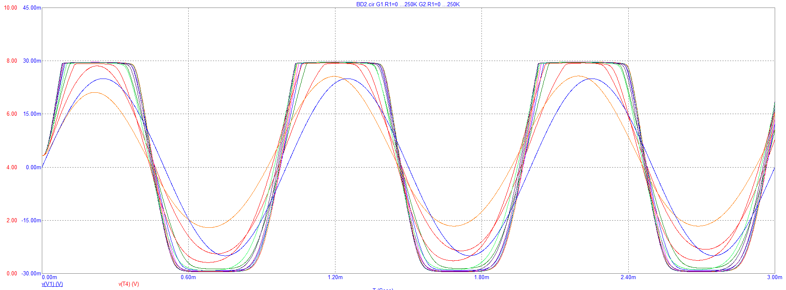

# About Wsprry Pi

WsprryPi creates a very simple WSPR beacon on your Raspberry Pi by generating a Pulse-Width Modulation (PWM) square-wave signal through a General-Purpose Input/Output (GPIO) pin on a Raspberry Pi.  As of version 3.0.0, the ability to use an inexpensive clock generator, the Si5351 was added.  This allows use of the more capable Raspberry Pi 5.

You connect the generated output through a [Low-Pass Filter to remove harmonics](https://www.nutsvolts.com/magazine/article/making\_waves\_) and then to an appropriate antenna.  It operates on bands from 2200m up to 6m.

**You should not use Wsprry Pi without a low-pass filter, as it will create interference from harmonics on other bands.**

This image shows a square waveform, typical of the output from the Pi GPIO, with an overlay showing how a waveform might look through successive low-pass filters:

Image from [https://analogisnotdead.com/article25/circuit-analysis-the-boss-bd2](https://analogisnotdead.com/article25/circuit-analysis-the-boss-bd2)

This software is compatible with:

- Raspberry Pi 1 Model B (2012)
- Raspberry Pi 1 Model A (2013)
- Raspberry Pi 1 Model B+ (2014)
- Raspberry Pi 1 Model A+ (2014)
- Raspberry Pi 2 Model B (2015)
- Raspberry Pi Zero (2015)
- Raspberry Pi 3 Model B (2016)
- Raspberry Pi Zero W (2017)
- Raspberry Pi 3 Model B+ (2018)
- Raspberry Pi 3 Model A+ (2018)
- Raspberry Pi 4 Model B (2019)
- Raspberry Pi 5 (2023)

The following are untested but will likely work:

- Raspberry Pi Compute Module 1 (2014)
- Raspberry Pi Compute Module 3 (2017)
- Raspberry Pi Compute Module 4 (2020)
- Raspberry Pi Compute Module 5 (2024)
- Raspberry Pi 400 (2020)
- Raspberry Pi 500 (2024)
- Raspberry Pi 500+ (2025)

The Raspberry Pi 5 (and variants) has a different chip configuration and is only supported via teh Si5351 clock generator option.

## Attribution

This idea likely originated from an idea Oliver Mattos and Oskar Weigl presented at the PiFM project.  While the website is no longer online, the Wayback Machine has [the last known good version]( http://web.archive.org/web/20131016184311/http://www.icrobotics.co.uk/wiki/index.php/Turning_the_Raspberry_Pi_Into_an_FM_Transmitter).

The icrobotics.co.uk website still hosts the original PiFM code.  However, I suspect the domain has fallen into disrepair and may be unsafe, and I will not provide direct links here.  You can use the URL above to see the site; should the code disappear, I have [saved it here](https://github.com/WsprryPi/WsprryPi/raw/refs/heads/main/historical/pifm.tar.gz).

After a conversation with Bruce Raymond of TAPR, I forked @threeme3's repo and provided some rudimentary installation capabilities and associated orchestration.  Version 1.x of this project was a fork of threeme3/WsprryPi (no longer on GitHub), licensed under the GNU General Public License v3 (GPLv3).  The original project is no longer maintained.

In late 2024, George [K9TRV] of TAPR contacted me about some questions related to using WsprryPi on the Pi 5.  The conversation spurred me to discard the original code in favor of a more modern, extensible, and maintainable base.

As of Version 2.0+, all of the original code has been replaced with my own; it is no longer derivative work and released it under the MIT license.

My goal, and where you will validate my success, is to allow you to execute one command on your Pi to install and run the Wsprry Pi software.  If you are lucky and have been living right, a radio wave will hit the cosmos and be received [somewhere else](https://wsprnet.org).
