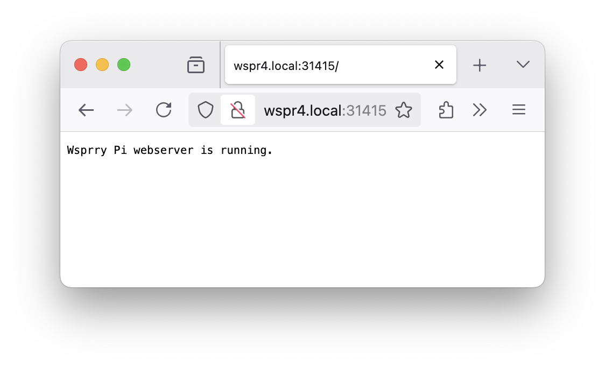

<!-- Grammar and spelling checked -->
# Advanced Operations

These topics cover the underlying controls and operating details behind WSPR and `wsprrypi`. Most users can stay in the web UI, but this page is useful when you need timing, calibration, or API details.

## Transmission Timing

This software uses system time to determine the start of WSPR transmissions, so keep the system clock synchronized to within one second. Use network time synchronization or set the time manually with `date`. A WSPR transmission starts on an even UTC minute and runs for about two minutes.

## Frequency Calibration

The system uses NTP calibration by default through `chrony` and can often reach about 0.1 PPM error after the Pi temperature stabilizes and the NTP loop converges.

Frequency calibration matters because WSPR occupies a narrow band. The Raspberry Pi reference crystal has both static error and temperature-dependent drift. You can rely on NTP-based correction or apply a fixed PPM correction manually.

### NTP Calibration

NTP tracks and calculates a PPM correction automatically. If your Pi is running NTP, use `--use-ntp` to query the latest correction before each WSPR transmission. Residual error can remain because of NTP loop delay, so this works best after the system has been powered on long enough for clock and temperature behavior to settle.

Starting in version 2.0, the installer replaces the default `ntpd` implementation with [Chrony](https://chrony-project.org/), which has proven more reliable for this application.

### AM Calibration

A practical manual method is to tune the transmitter near a medium-wave AM broadcast station, zero-beat the signal, and calculate the remaining frequency error from the known station frequency.

Suppose your local AM station is at 780 kHz. Use `--test-tone` to produce nearby tones, such as `780100`, until you achieve zero beat. If the zero-beat tone on the command line is `F`, calculate the correction as `ppm=(F/780000-1)*1e6`. You can then supply that value with `--ppm` on future transmissions.

## INI File

The daemon reads `wsprrypi.ini` for its execution parameters. In normal use there is rarely a reason to edit the file directly. The installer stores it in the user data directory:

```bash
$ ls -al /usr/local/etc
total 12
drwxr-xr-x  2 root root 4096 Feb 18 14:51 .
drwxr-xr-x 10 root root 4096 Sep 21 19:02 ..
-rw-rw-rw-  1 root root  171 Mar  6 19:47 wsprrypi.ini
```

The file uses standard INI syntax. It has four sections: `Control`, `Common`, `Extended`, and `Server`. Blank lines and extra whitespace are ignored. Each setting is a key/value pair separated by an equals sign.

This is the default INI file that ships with the installation. Any comments in the file must begin with a semicolon (`;`).

```ini
; Created for WsprryPi version 2.0
; Copyright (C) 2023 - 2026 Lee C. Bussy (@LBussy)

; Edit the values below as needed.  Do not remove sections or keys.

[Control]
; Transmit: Set to True to enable transmitting, False to disable.
Transmit = true

[Common]
; Call Sign: Your ham radio call sign (maximum 7 characters).
Call Sign = AA0NT
; Grid Square: Your location's Maidenhead grid square (4 characters).
Grid Square = EM18
; TX Power: Transmitter power in dBm (integer, e.g., 20).
TX Power = 20
; Frequency: Transmission frequency in meters (e.g., '20m') or Hz (e.g., '450000000').
Frequency = 40m
; Transmit Pin: The GPIO pin for WSPR transmissions (BCM numbering).
Transmit Pin = 4

[Extended]
; PPM: Frequency offset in parts per million (floating-point).
PPM = 0
; Use NTP: Calibrate tones via NTP
Use NTP = true
; Offset: Set to True to enable frequency offset correction, False to disable.
Offset = true
; Use LED: Set to True to enable LED usage, False to disable.
Use LED = true
; LED Pin as a GPIO/BCM designation, e.g., Pin 12/GPIO18/BCM18 = 18
LED Pin = 18
; Power Level: Output power level (integer from 0 to 7, where 7 is maximum).
Power Level = 0

[Server]
; Port used for REST interface
Web Port = 31415
; Port used for websockets
Socket Port = 31416
; Use Shutdowwn: Set to True to enable shutdown button, False to disable.
Use Shutdown = true
; PIN (BCM) used for shutdown watcher
Shutdown Button = 19
```

## REST and Web Sockets

Wsprry Pi 2.x introduces both a REST API and a Web Socket interface.

### REST API

The executable exposes a REST API on port `31415` by default. A basic health check is available at `http://{servername}.local:31415/`:



You can `GET` the configuration from `http://{servername}.local:31415/config`, and a `PUT` request with a valid JSON payload will update it. A typical payload looks like this:

```json
{
    "Common": {
        "Call Sign": "AA0NT",
        "Frequency": "40m",
        "Grid Square": "EM18",
        "TX Power": 20,
        "Transmit Pin": 4
    },
    "Control": {
        "Transmit": true
    },
    "Extended": {
        "LED Pin": 18,
        "Offset": true,
        "PPM": 0.0,
        "Power Level": 0,
        "Use LED": true,
        "Use NTP": true
    },
    "Meta": {
        "Center Frequency Set": [],
        "Date Time Log": true,
        "INI Filename": "/usr/local/etc/wsprrypi.ini",
        "Loop TX": false,
        "Mode": "WSPR",
        "TX Iterations": 0,
        "Test Tone": 730000.0,
        "Use INI": true
    },
    "Server": {
        "Shutdown Button": 19,
        "Socket Port": 31416,
        "Use Shutdown": true,
        "Web Port": 31415
    }
}
```

You can also `GET` the version payload from `http://{servername}.local:31415/version`:

```json
{
    "wspr_version": "1.2.1-2-0-devel+1bfaecb (2-0-devel)"
}
```

### Web Socket

The executable exposes a Web Socket on port `31416` by default. Available commands include:

- `get_tx_state`: The server responds with `{"tx_state": true}` or `{"tx_state": false}`.
- `reboot`: The server responds with `{"command": "reboot"}` and reboots the server.
- `shutdown`: The server responds with `{"command": "shutdown"}` and shuts down the server.

As long as the connection remains open, the server broadcasts certain events to connected clients:

- **Configuration reload:** Tells connected clients that the INI file has been updated and the cached configuration should be refreshed.
  `{"state":"reload","timestamp":"2025-05-06T16:43:02Z","type":"configuration"}`
- **Transmission start:** Tells connected clients that a transmission has started.
  `{"state":"starting","timestamp":"2025-05-06T16:40:01Z","type":"transmit"}`
- **Transmission complete:** Tells connected clients that a transmission has finished.
  `{"state":"finished","timestamp":"2025-05-06T16:41:51Z","type":"transmit"}`

## PWM Peripheral

The code uses the Raspberry Pi PWM peripheral to time the frequency transitions of the output clock. The Raspberry Pi sound system also uses this peripheral, so sound activity during a WSPR transmission can interfere with transmission quality. The install script disables the onboard sound path automatically, so most users do not need to make a manual change.

## RF And Electrical Considerations

The Pi PWM output is a square wave, so a low-pass filter is required. Connect a low-pass filter through a DC-blocking capacitor to GPIO4 (`GPCLK0`) and a ground pin on the Raspberry Pi before connecting an antenna. GPIO4 and ground are on header pins 7 and 9 respectively. See [this reference](http://elinux.org/RPi\_Low-level\_peripherals) for pin layout details.

Examples of low-pass filters can be [found here](http://www.gqrp.com/harmonic\_filters.pdf). TAPR also offers a [shield for the Raspberry Pi](https://www.tapr.org/kits_20M-wsprrypi-pi.html) that provides band-appropriate filtering and amplifies the output to 20 dBm.

The expected power output from the Pi is configurable from the command line or the web UI. When connected to a simple dipole antenna, this small amount of power may still result in reception reports over long distances.

Because the Raspberry Pi does not strongly attenuate ripple and noise from the 5 V supply, use a regulated power supply with good ripple suppression. Supply ripple can appear as mixing products centered around the transmit carrier, typically at 100 Hz or 120 Hz.

Do not expose GPIO4 to voltages or currents above the absolute maximum limits. GPIO4 outputs a 3.3 V digital clock with a maximum current of 16 mA. Do not short the pin or connect a resistive dummy load directly to it. Use a decoupling capacitor to remove the DC component when connecting loads, transformers, or antennas. Antennas can also expose the GPIO pin to static and induced RF energy, so some form of isolation is recommended.
