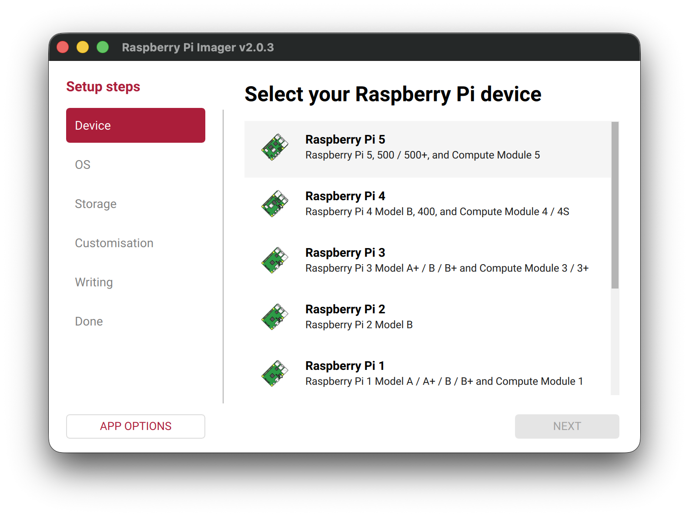

# Installing Wsprry Pi

## Gather Hardware

You will need the following:

- A Raspberry Pi
- An SD card for the OS image
- A power supply for the Pi.  Pay attention to potentially noisy power supplies here.  You will benefit from a well-regulated supply with sufficient ripple suppression.  You may see supply ripple as mixing products centered around the transmit carrier, typically at 120Hz (60Hz mains frequency) and 100Hz (50Hz mains frequency).

If you are using a Raspberry Pi 5 or variants, you will additionally need the Si5351 Clock Generator.  While I have provided a KiCad design for a Pi HAT with a purpose-built circuit surrounding the Si5351, you also may use one of the common breakout boards:

- [Adafruit Si5351 Clock Generator Breakout](https://learn.adafruit.com/adafruit-si5351-clock-generator-breakout/overview) - This will work for frequencies up to 6m; the 25MHz TCXO is not well suited for 2m.
- [QRP Labs Si5351A Synthesizer](https://www.qrp-labs.com/synth.html) - This breakout kit comes with a 27MHz TCXO, capable of transmissions through 2m.

The Si5351 is controlled through the Pi's [I2C bus](https://pinout.xyz/pinout/i2c), requiring a connection to GPIO2 and GPIO3 for this communication.

## Prerequisites

This section may be the most challenging part of the whole installation.  *You must have a working Raspberry Pi with Internet access.* It can be hard-wired or on Wi-Fi.  There is no better place to learn how to set up your new Pi than from the people who make it themselves.  [Go here](https://www.raspberrypi.com/documentation/computers/getting-started.html), and learn how to install the operating system with the [Raspberry Pi Imager](https://www.raspberrypi.com/software/).  To enable SSH access, pre-configure your image with your local/time zone, Wi-Fi credentials, and a unique hostname.



I am only testing the current [`stable` versions](https://www.debian.org/releases/stable/).  Testing everything on more than one release, 32 and 64-bit, and now GPIO and Si5153, with WSPR 1, 2 and 3, plus three CW modes, takes more time than I have right now.  In theory it will compile and run on [`oldstable`](https://www.debian.org/releases/oldstable/) but I won't support issues there.

You can use a full-featured desktop version with all the bells and whistles, or Wsprry Pi will run just fine on the Lite version on an SD card as small as 2 GB (although a minimum of 8 GB seems more comfortable these days).  You can even run it headless without a keyboard, mouse, or monitor.  If you enable SSH, you can use your command line from Windows 10/11, macOS, or another Pi.

Whatever you do, you will need command-line access to your Pi to proceed via SSH or the console.  Once you are up and running and connected to the Internet, you may proceed with Wsprry Pi installation.  Each time I update this documentation, the Raspberry Pi Imager has changed the workflow.  Use Internet resources to find your best path.  You will only need command line (SSH) access to the Pi, but you are welcome to use any other configuration.

## System Changes

Aside from the obvious, installing Wsprry Pi, the install script will do the following:

- **Install Apache2**, a popular open-source, cross-platform web server that is the most popular web server by the numbers.  The [Apache Software Foundation](https://www.apache.org/) maintains Apache.  Apache is used to control Wsprry Pi from an easy-to-use web page.  Additionally, if you have not previously used the Apache installation, a redirect from the root of the web server to `/wsprrypi/` will be created for ease of use.  Finally, the script creates three proxies to communicate from the web page to the application:
  - `http://127.0.0.1:31415/config` to `/wsprrypi/config` for getting/setting the configuration
  - `http://127.0.0.1:31415/version` to `/wsprrypi/version` to retrieve the running version.
  - `ws://127.0.0.1:31416/socket` to `/wsprrypi/socket` for Web Socket communications.
- **Install Chrony**, [a replacement for ntpd](https://chrony-project.org/).
- **Install PHP**, a popular, general-purpose scripting language that is especially suited for web development.  The [PHP Group](https://www.php.net/) maintains PHP.  I wrote the web pages in PHP.
- **Install Raspberry Pi development libraries and other Packages**, `git`, and `libgpiod`.
- **Compile and configure Wsprry Pi**
- **Disable the Raspberry Pi's built-in sound card.** Wsprry Pi uses the RPi PWM peripheral to time the frequency transitions of the output clock.  The Pi's sound system also utilizes this peripheral; any sound events during a WSPR transmission will interfere with the WSPR transmission.

## Install WSPR

You may use this command to install Wsprry Pi (one line):

`curl -fsSL installwspr.aa0nt.net | sudo bash`

This shorter URL relies on my hosted DNS for a redirect to GitHub.  If my DNS is broken for some reason, you may see an error like this:

`curl: (22) The requested URL returned error: 404`

If that happens, this longer form should work:

`curl -fsSL https://raw.githubusercontent.com/WsprryPi/WsprryPi/refs/heads/main/scripts/install.sh | sudo bash`

This install command is idempotent; running it additional times will not have any negative impact.  If an update is released, re-run the installer to take advantage of the new release.

Since the installation script compiles the application on your Pi to avoid any version errors, it will take some time on older Pis with fewer resources.  A Pi 3 with 1 GB of memory takes about 20 minutes.  If the script detects a system with fewer resources, it will intentionally use fewer resources, resulting in a slower installation time.  If that is the case, it will issue a warning:

```text
[WARN ] The compilation step may take from 10m (Pi 3) to up to 50m (Pi 1)
```

I have GREATLY simplified the installer since version 1.x.  Here is more or less what you will see:

```text
[INFO ] Checking environment.
[INFO ] Wsprry Pi installation beginning.
[INFO ] System: Debian GNU/Linux 12 (bookworm).
[INFO ] Running Wsprry Pi's install script, version 2.1.0.
[WARN ] The compilation step may take from 10m (Pi 3) to up to 50m (Pi 1)
[INFO ] Updating and managing required packages (this may take a few minutes).
[  ✔  ] Complete: Update local package index.
[  ✔  ] Complete: Fix broken or incomplete package installations.
[  ✔  ] Complete: Upgrade git.
[  ✔  ] Complete: Install apache2.
[  ✔  ] Complete: Install php.
[  ✔  ] Complete: Install chrony.
[  ✔  ] Complete: Install libgpiod-dev.
[  ✔  ] Complete: Upgrade libgpiod2.
[  ✔  ] Complete: Clone repository 'https://github.com/WsprryPi/WsprryPi'.
[  ✔  ] Complete: Reset failed systemd states.
[  ✔  ] Complete: Reload systemd daemon.
[  ✔  ] Complete: Compile release binary.
[  ✔  ] Complete: Move binary to staging.
[  ✔  ] Complete: Install application.
[  ✔  ] Complete: Change ownership on application.
[  ✔  ] Complete: Make app executable.
[  ✔  ] Complete: Install configuration.
[  ✔  ] Complete: Change ownership on configuration.
[  ✔  ] Complete: Set config permissions.
[  ✔  ] Complete: Copy systemd file.
[  ✔  ] Complete: Change ownership on systemd file.
[  ✔  ] Complete: Change permissions on systemd file.
[  ✔  ] Complete: Create log path.
[  ✔  ] Complete: Change ownership on log path.
[  ✔  ] Complete: Change permissions on log path.
[  ✔  ] Complete: Enable systemd service.
[  ✔  ] Complete: Reload systemd.
[  ✔  ] Complete: Start systemd service.
[  ✔  ] Complete: Change ownership on logs.
[  ✔  ] Complete: Change permissions on logs.
[  ✔  ] Complete: Install configuration.
[  ✔  ] Complete: Change ownership on configuration.
[  ✔  ] Complete: Set config permissions.
[  ✔  ] Complete: Create target web directory.
[  ✔  ] Complete: Copy web files.
[  ✔  ] Complete: Set ownership.
[  ✔  ] Complete: Set directory permissions.
[  ✔  ] Complete: Set file permissions.
[  ✔  ] Complete: Insert ServerName directive.
[  ✔  ] Complete: Copy Apache vhost to sites-available.
[  ✔  ] Complete: Enable proxy modules.
[  ✔  ] Complete: Disable default site.
[  ✔  ] Complete: Enable wsprrypi site.
[  ✔  ] Complete: Test Apache configuration.
[  ✔  ] Complete: Reload Apache.
[  ✔  ] Complete: Delete local repository.
```

You may see:

```text
*Important Note:*

Wsprry Pi uses the same hardware as the sound system to generate
radio frequencies.  This soundcard has been disabled.  You must
reboot the Pi with the following command after install for this
to take effect:

'sudo reboot'

Press any key to continue.
```

The installation will finish with:

```text
Installation successful: Wsprry Pi.

To configure Wsprry Pi, open the following URL in your browser:

 http://wspr3.local/wsprrypi/
 http://10.0.0.52/wsprrypi/

If the hostname URL does not work, try using the IP address.
Ensure your device is on the same network and that mDNS is
supported by your system.
```

If the script prompts you to reboot, do that now.  At this point (and if you rebooted if prompted), Wsprry Pi is installed and running.

Note the URL for the configuration UI, listed as `{name}.local`, and the IP address choice.  You can access your system using the `{name}.local` name without needing to remember the IP address.  The `{name}.local` is convenient for automatically assigned IP addresses in most home networks.  The IP address of your Raspberry Pi may change over time, but its name will remain the same.

Some Windows systems can use this naming standard without additional work, but others may need to install Apple's [Bonjour Print Services](https://support.apple.com/kb/dl999) to enable this helpful tool.  If you encounter a 'host not found' error, try installing Bonjour.

Connect to your new web page from your favorite computer or cell phone using the IP address or the `{name}.local` name, and you can begin setting things up.  See Operations for more information.

## Additional Hardware

While the TAPR Hat is optional, an antenna is not.  Choosing an antenna is beyond the scope of this documentation; however, you can use a simple random wire connected to the [GPIO4 pin (GPCLK0)](https://pinout.xyz/pinout/pin7_gpio4/), which is labeled `7` on the header.

As explained above, if you are using a Pi 5, you will not use the GPIO4 connection and instead leverage the Si5351.
