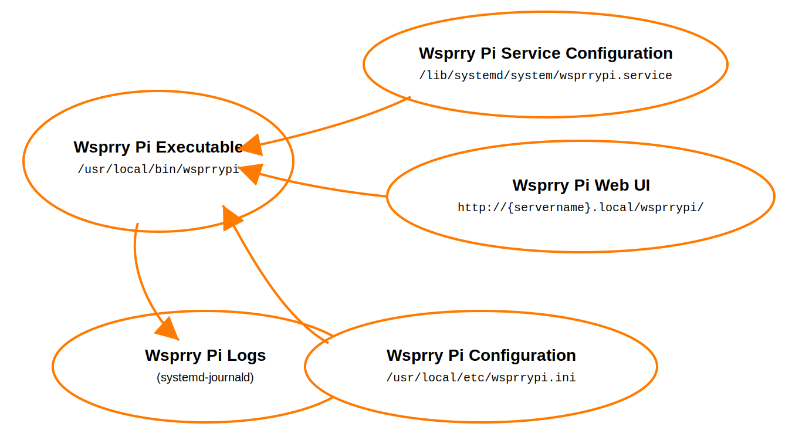

<!-- Grammar and spelling checked -->
# Wsprry Pi System Internals

The system consists of the following:

- `wsprrypi` (executable): Installed to `/user/local/bin/wsprrypi`
- `wsprrypi.ini` (configuration): Installed to `/user/local/etc/wsprrypi.ini`
- `wsprrypi.service` (service control file): Installed to `/lib/systemd/system/wsprrypi.service`
- Wsprry Pi Web UI: Installed to `/var/www/html/wsprrypi`

The primary data flow is as follows:

## Log Files

As of 2.2.x, the `wsprrypi` service will log messages to the Debian `systemd-journald` facility.

See the section on the [Log Panel](../User_Interface/Logs/index.md) for more information.
