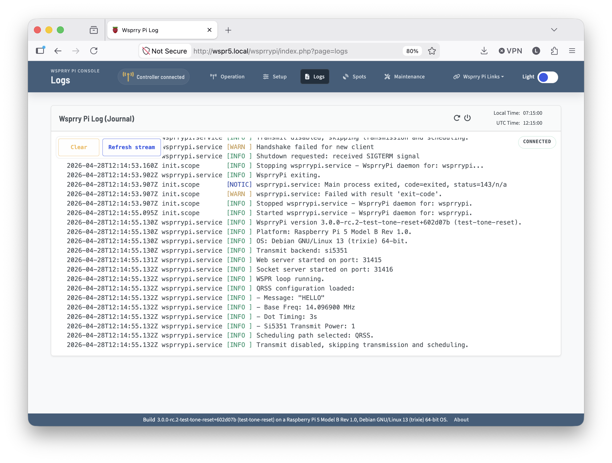

<!-- Grammar and spelling checked -->
# Log Card



The log page auto-refreshes as your Wsprry Pi server generates logs. It accesses them from the Debian systemd-journald system.

If you need more than what is displayed, you can find the complete logs on the Pi with the command `journalctl -u wsprrypi.service`. By default, the Raspberry Pi retains only the current boot’s logs. You can make these persistent with:

```bash
sudo mkdir -p /etc/systemd/journald.conf.d
sudo nano /etc/systemd/journald.conf.d/persistent.conf
```

Then put this in the persistent.conf file

```ini
[Journal]
Storage=persistent
SystemMaxUse=64M
SystemKeepFree=200M
MaxRetentionSec=14day
```

Then restart journald:

```bash
sudo systemctl restart systemd-journald
```

And then reboot:

```bash
sudo reboot
```

After reboot you can see the log versions stored:

```bash
journalctl --list-boots
```

Then, to go back to view the previous boot’s logs, issue the command:

```bash
journalctl -u wsprrypi.service -b -1
```

If you want to pull from multiple boots (change the range as appropriate):)

```bash
journalctl -u wsprrypi.service -b -3 -b -2 -b -1 -b 0
```
