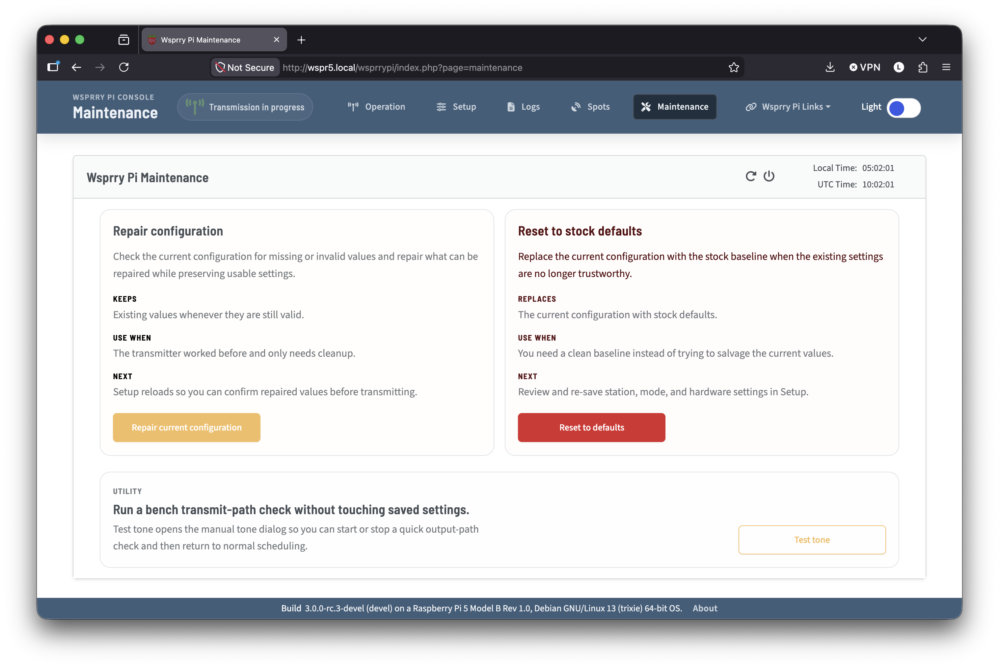
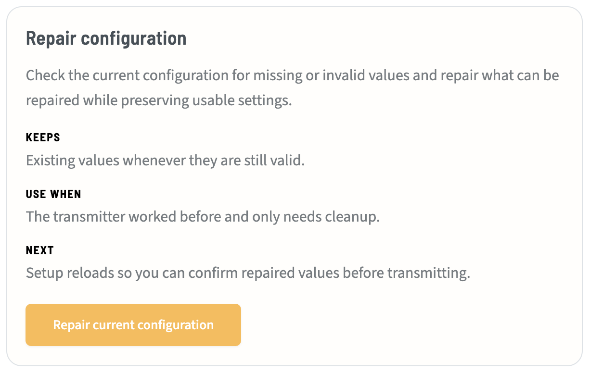
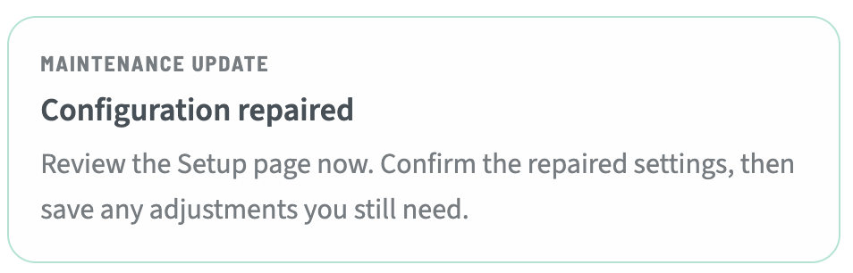
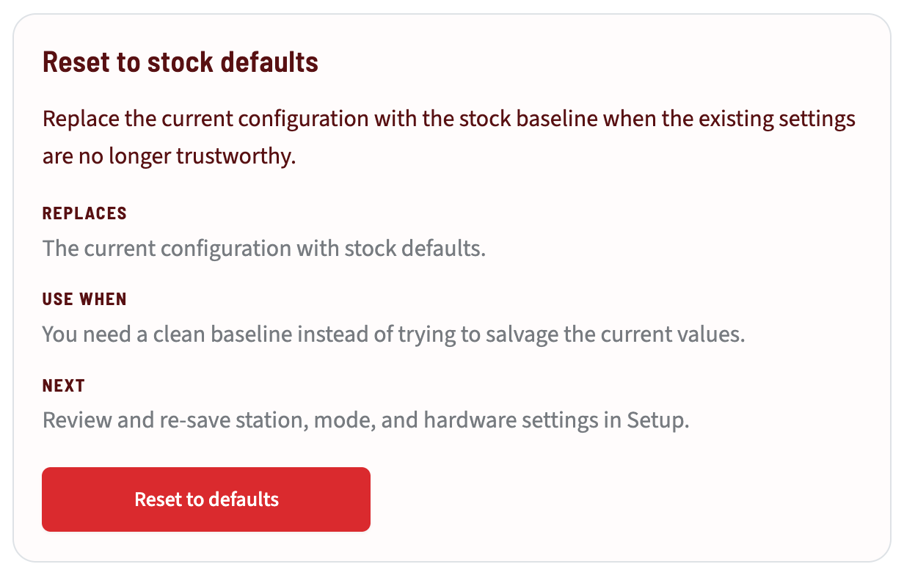
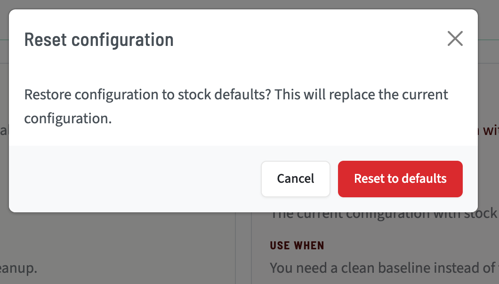
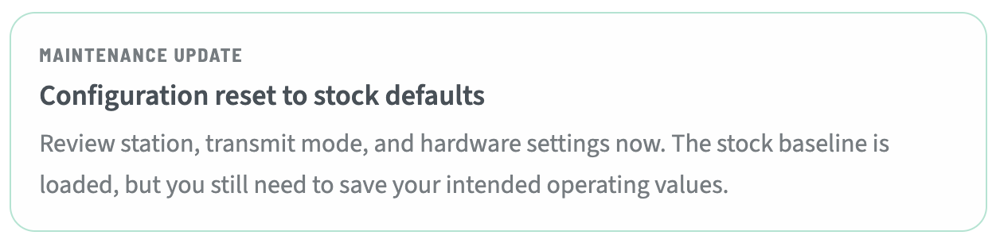
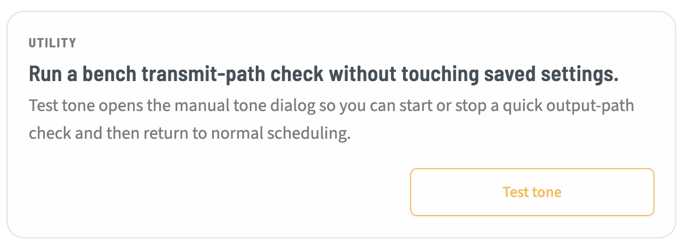
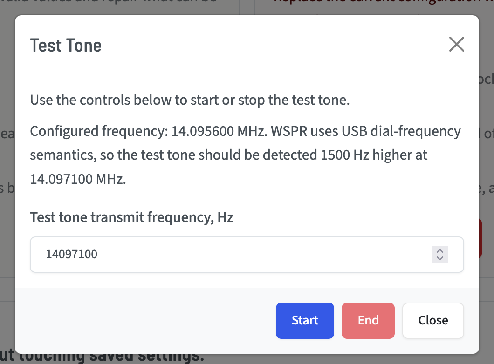
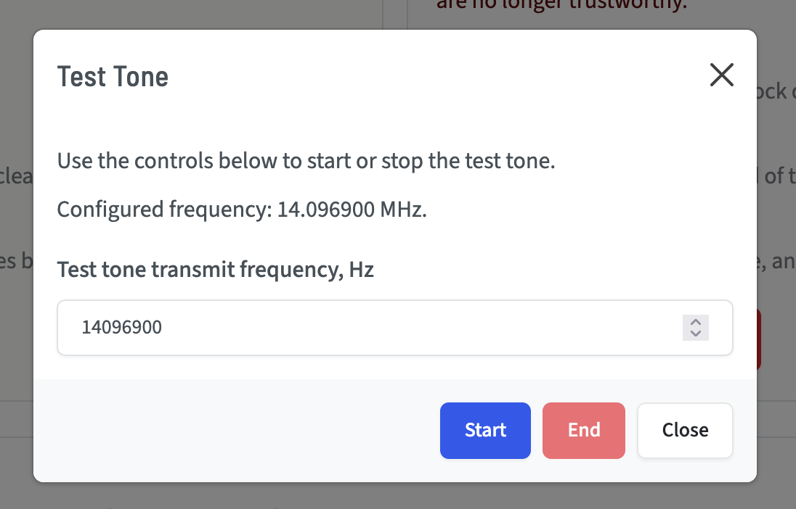
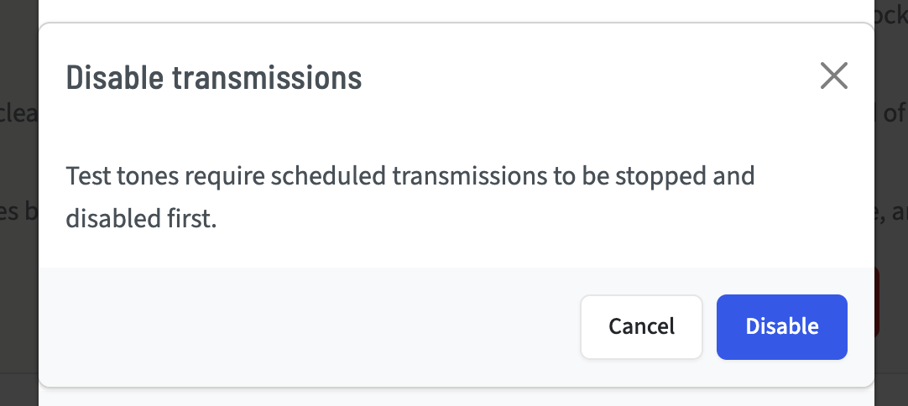

# Maintenance

The maintenance page allows you to perform tasks that are not necessarily related to the business of transmitting WSPR or QRSS modes, but that you may need from time to time.



## Repair Configuration

In rare cases, you may find that your configuration is present and readable but has missing sections or is otherwise not fully functional. If you hand-edit your INI, for example, and mistakenly delete sections or keys.



When you press the "Repair current configuration" button, you will not be prompted before execution because it is considered a safe operation. A stock configuration file will be created, and your current configuration values will be applied on top. Missing or invalid data will be restored from the stock configuration.



After this action, you should review all your settings to ensure they are still correct.

## Reset to Stock

This process is helpful if your INI file is damaged on disk or completely missing.



Unlike the Repair Configuration button, it does not preserve existing user values. It copies a new stock `wsprrypi.ini` file in place of your current one if it exists, and reloads the configuration shipped with the application.

When you press the "Reset to defaults" button, you will be presented with a confirmation modal because this will destroy your existing configuration.



Confirm the action, and the process will complete and return the status.



You will need to reconfigure all of your preferences before continuing to transmit.

## Test Tone

A test tone is useful for manual calibration, SWR testing, and tuning your antenna.



Press the "Test tone" button, and you are presented with a modal.



This modal presents your currently configured frequency as the default frequency for the test tone. There is also a critical callout while in WSPR mode:

WSPR transmits in USB. Your dial frequency is the value you enter in the setup pages. WSPR tones are ~1500 Hz higher than the dial frequency. When you are configured in WSPR for 20m, your dial frequency is 14.0956 MHz, but your transmit frequency is actually 14.097100 MHz.

You can see this distinction in the logs:

```text
2026-04-29T11:56:59.910Z wsprrypi.service [INFO ] WSPR-band test tone using dial frequency: 14.095600 MHz
2026-04-29T11:56:59.911Z wsprrypi.service [INFO ] Started transmission: 14.097100 MHz.
```

You may change the transmit frequency here, if desired.

When you are in CW mode, there is no Upper Sideband offset, so the frequency you set is actually the transmit frequency:



Should you be configured to transmit in either WSPR or CW mode, the page will prompt you to stop and disable those transmissions before proceeding.



You will need to re-enable transmissions again on the Operations page when you are finished testing.
