# Maintenance Card

The maintenance page allows you to perform tasks that are not necessarily related to the business of transmitting WSPR or QRSS modes, but that you may need from time to time.

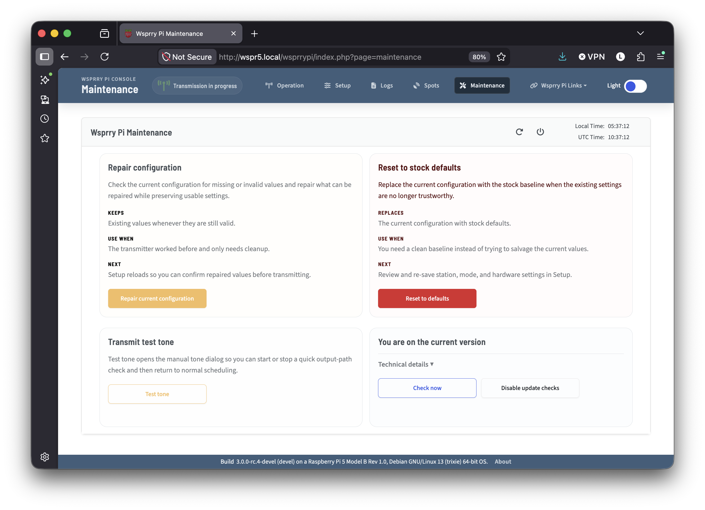

## Repair Configuration

In rare cases, you may find that your configuration is present and readable but has missing sections or is otherwise not fully functional. If you hand-edit your INI, for example, and mistakenly delete sections or keys.

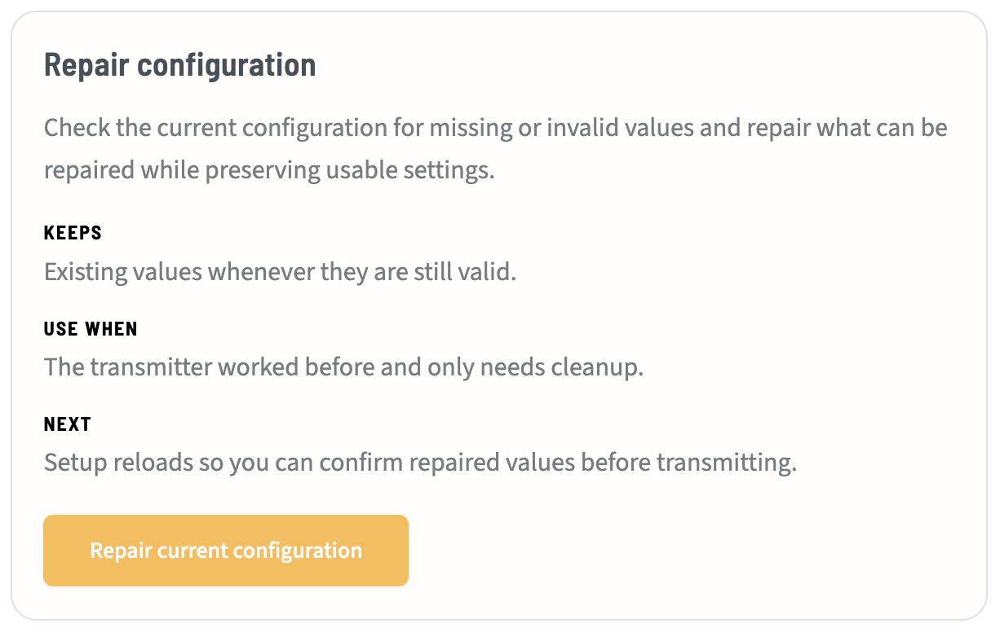

When you press the "Repair current configuration" button, you will not be prompted before execution because it is considered a safe operation. A stock configuration file will be created, and your current configuration values will be applied on top. Missing or invalid data will be restored from the stock configuration.

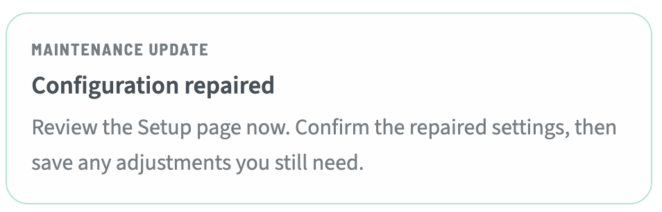

After this action, you should review all your settings to ensure they are still correct.

## Reset to Stock

This process is helpful if your INI file is damaged on disk or completely missing.

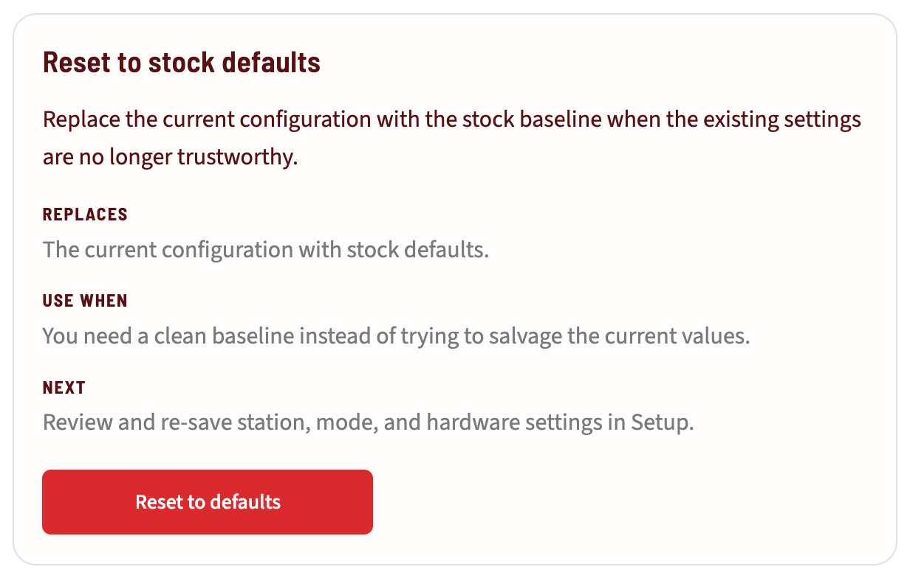

Unlike the Repair Configuration button, it does not preserve existing user values. It copies a new stock `wsprrypi.ini` file in place of your current one if it exists, and reloads the configuration shipped with the application.

When you press the "Reset to defaults" button, you will be presented with a confirmation modal because this will destroy your existing configuration.

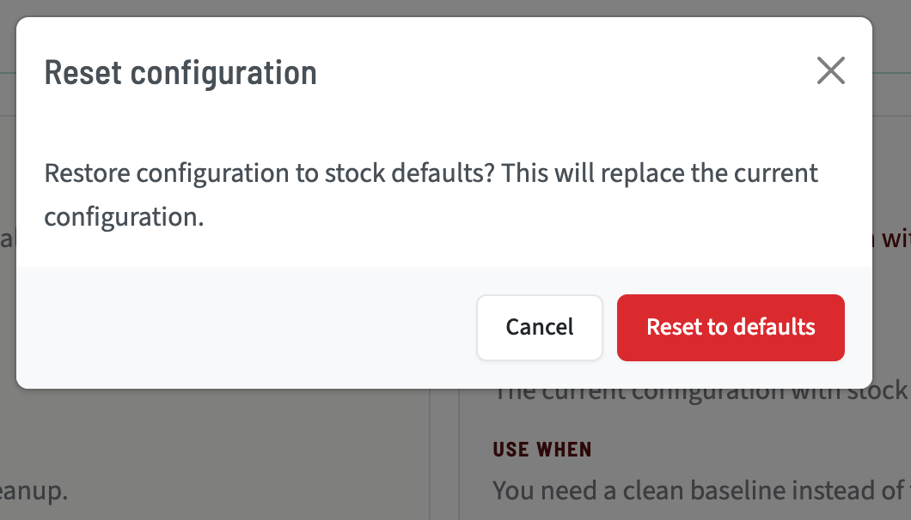

Confirm the action, and the process will complete and return the status.

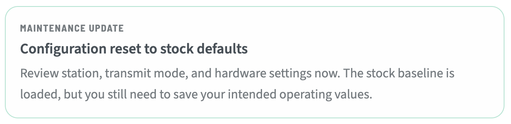

You will need to reconfigure all of your preferences before continuing to transmit.

## Privileged Network Safety

**Privileged network safety** limits configuration changes, device controls,
support-bundle operations, and the browser WebSocket connection to clients on
the Raspberry Pi's directly connected Ethernet or Wi-Fi networks. It is
network-location access control, not authentication: it does not distinguish
between users already on an allowed LAN and does not encrypt traffic.

The Maintenance page reports three values separately:

- **Requested** is the unsaved choice currently selected in the browser.
- **Configured** is the value stored in `wsprrypi.ini`.
- **Active** is the policy confirmed in the backend and Apache.

Keep **Enforced** selected for normal operation. Browser operation uses the
normal port-80 Apache site; the UI does not fall back to the direct backend
ports for this control. When enforcement is active, Apache also restricts the
entire browser-facing WebSocket endpoint. Off-LAN clients therefore cannot use
read-only WebSocket commands or receive its broadcasts.

The insecure override is intended only for deliberate administrator recovery
or an explicitly accepted network design. Select **Insecure disabled**, type
`DISABLE LOCAL-LAN SAFETY` exactly, and then select **Apply requested state**.
The setting is not part of Setup autosave. When the insecure override is
active, the page displays **NETWORK SAFETY OFF**.

Applying either value validates the candidate Wsprry Pi and Apache
configuration, reloads Apache without rebooting, and confirms the active
policy. If validation, reload, or confirmation fails, the page preserves your
requested choice and reports that the requested, configured, and active values
may differ. Resolve the reported problem and verify the displayed state before
trying again.

Disabling this LAN check does not disable Host, Origin, CORS, malformed-request,
HTTP method, command, forwarded-header, or ordinary configuration validation.
See [Privileged Network Safety](network_safety.md) for protected operations,
direct-backend behavior, network-change handling, and recovery guidance.

## Test Tone

A test tone is useful for checking the transmit path, calibration, and tuning.
Connect the transmitter to a suitable dummy load or attenuated test path before
starting. Keep the test brief, and select **End** as soon as the check is
complete.

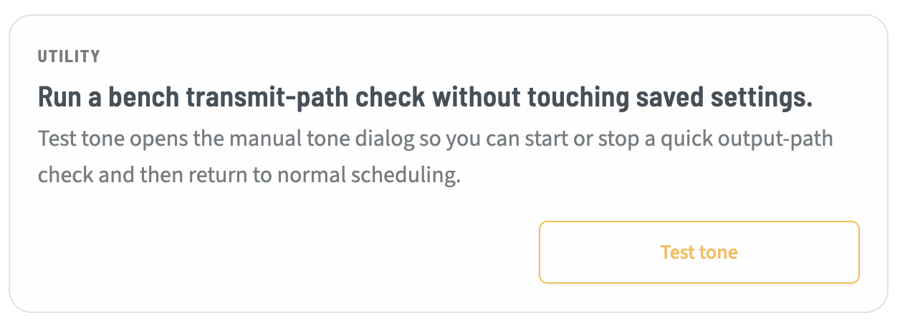

Select **Test tone** to open the manual tone controls. This does not change the
frequency saved in Setup.

### Choose the frequency source

Choose one of these frequency sources:

- **WSPR band** uses a canonical band entry supplied by the connected
  controller. The preview shows the WSPR dial frequency and the resulting RF
  frequency after the WSPR offset is applied.
- **Custom RF frequency** accepts an exact, whole-number frequency in Hz. This
  value is the RF frequency; no WSPR offset is added.

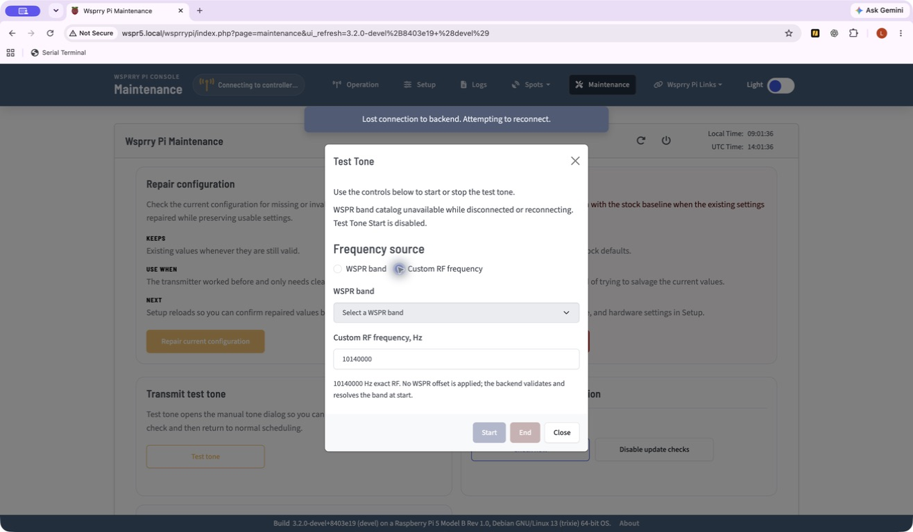

The example above shows the safe disconnected state: the frequency source and
exact RF preview remain visible, while **Start** and **End** are unavailable.

The WSPR band list is controller-authorized rather than a fixed list in the
browser. **Start** remains unavailable until the controller is connected, its
catalog is available, a valid frequency source is selected, and normal
transmission interlocks permit a test tone. A disabled button is visually
muted and cannot be selected.

If scheduled WSPR or CW-family transmission is enabled, the page prompts you
to stop and disable it before starting a test tone.

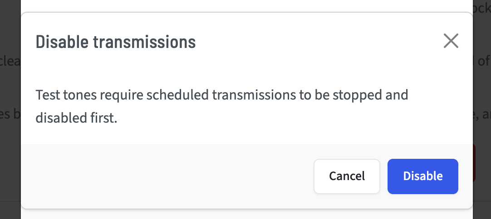

You must re-enable normal transmissions on the Operations page after testing.

### Read the result

Before **Start**, the frequency summary is a preview of the request. After the
controller replies, the execution status reports what the controller actually
committed. When the committed frequency matches the preview, the status does
not repeat the full dial-frequency, offset, and RF-frequency calculation.

The execution status calls out information that changes what you should do,
including:

- a committed frequency that differs from the request;
- controller selector details or warnings;
- a rejected or failed start; and
- whether **End** remains available for recovery.

After the controller confirms a successful stop, the status reads **Test Tone
ended.** **Start** becomes available again when the connection, catalog,
selection, and interlocks still permit it.

### Recover from an uncertain result

If a Start or End request times out, or the connection drops before the result
is confirmed, the browser cannot safely claim whether RF is active. Follow the
status guidance and reconnect if necessary. **End** remains available whenever
the tone may still be active, including after reconnect or when the WSPR catalog
is unavailable. Use **End** to request a confirmed stop before attempting
another Start.

The controller serializes Test Tone **Start** and **End** requests. Each
lifecycle action and its result broadcast complete before the next action is
processed.


## Update Checker

The Wsprry Pi UI automatically checks the running build against eligible releases and its trusted upstream branch on GitHub. A newer tagged release is shown as an **Update available**. A non-main development build may instead show **Newer branch build available** when its upstream branch contains the running commit and has newer commits.

Tagged-release notifications provide a link to the [Releases page](https://github.com/WsprryPi/WsprryPi/releases/). Branch-build notifications identify the target branch and commit and direct prerelease users to their designated update channel; they do not present an unrelated Releases link.

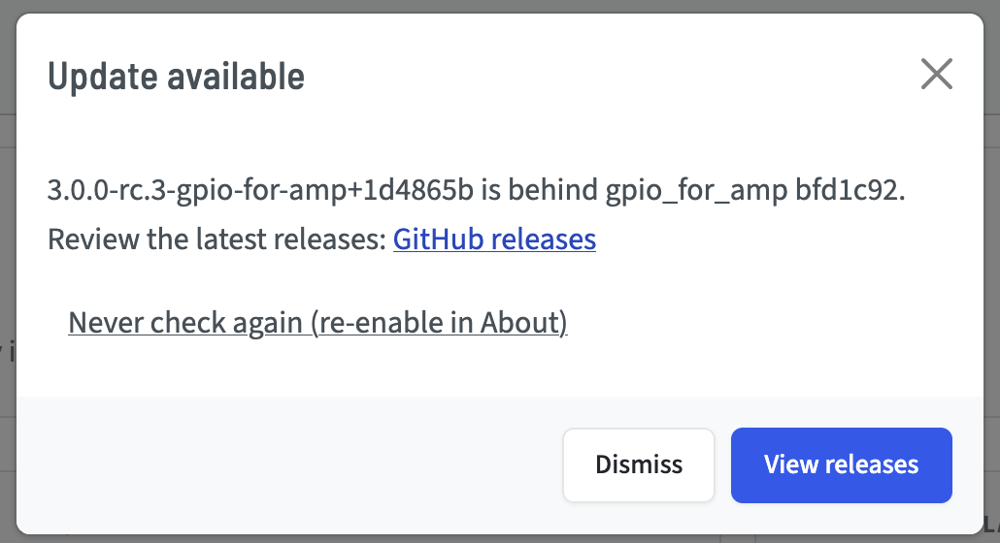

You may also check manually on the Maintenance page, and force an immediate check.

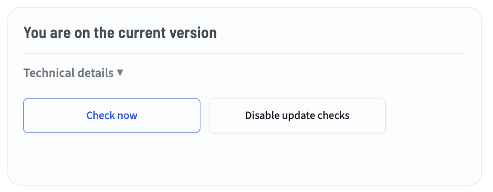

You may dismiss the modal, and the footer will continue to quietly show the release or branch-build notification.

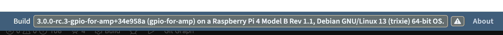

You may also choose to "Never check again" either in the modal, or by selecting "About" in the footer.

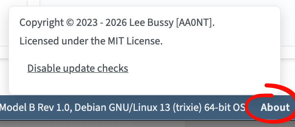

If you choose to never check again and wish to re-enable the checking, the opposite setting is available in the "About" footer, as well as in the update check section in the maintenance panel.

Technical information on the update check process is available in the [WsprryPi Automatic Update Polling](update_check.md) technical page.

## Support Bundle

Use **Support Bundle** when the Wsprry Pi maintainer asks for diagnostic information. The workflow records useful support context, creates a readable `.tar.gz` candidate locally, lets you inspect it, encrypts the exact bytes you approve, and hands only the encrypted `.age` file to a private Dropbox File Request.

Review the readable archive before encryption. See [Create and Share a Support Bundle](support_bundle.md) for privacy guidance, collection inventory, encrypted upload, receipt handling, truthful upload states, GitHub correlation, and cleanup.

```{toctree}
:maxdepth: 1
:hidden:

Create and Share a Support Bundle <support_bundle>
Privileged Network Safety <network_safety>
```
