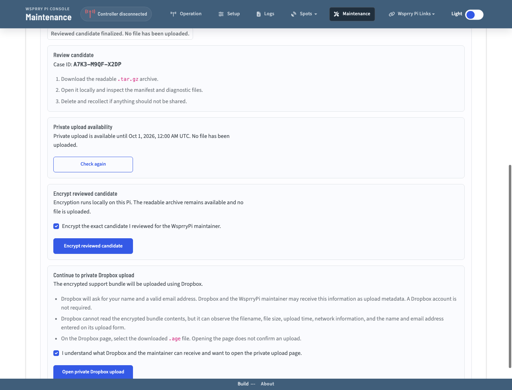

# Create and Share a Support Bundle

A support bundle gathers diagnostic information that can help the Wsprry Pi maintainer investigate a problem. The Maintenance workflow creates a readable archive on your Raspberry Pi, lets you inspect it, encrypts the exact archive you approved, and then opens a private Dropbox upload page. Wsprry Pi never uploads the readable archive.

:::{important}
A support bundle may identify you, your station, equipment, or network. It can include callsigns, Maidenhead locators, host and user names, internal addresses, configuration values, logs, project paths, and service details. Automatic credential redaction is best-effort. Download and inspect the readable archive before approving encryption.
:::

## Create the Bundle

1. Open **Maintenance** in the Wsprry Pi web interface.
2. In **Support Bundle**, select **Start support bundle**.
3. Choose how the bundle will be associated with your support request:
   - Enter the number of an existing WsprryPi GitHub issue.
   - Choose to create a GitHub issue after collection. Enter a useful problem description and contact method for the private bundle record.
   - Choose **I am not using GitHub**. Enter a useful problem description and contact method.
4. Leave **Actively probe I²C bus 1** cleared unless the maintainer specifically requests an active bus scan.
5. Select **Create readable candidate**.
6. Wait while the panel reports that the bundle is queued or being collected. Collection time varies, so the interface does not invent a percentage or completion estimate.
7. When collection finishes, record the displayed case ID and select **Download readable candidate**.

The active I²C option is off by default. Passive I²C information is collected either way. Selecting the option runs exactly:

```bash
i2cdetect -y 1
```

That command actively probes every address on I²C bus 1. Leave it off when you do not need the scan or are unsure whether attached devices tolerate active probing.

The downloaded filename has this form:

```text
WsprryPi-support-HOST-UTC_TIMESTAMP.tar.gz
```

Your browser chooses the save location. Wsprry Pi can report the filename, but it cannot reliably report the final folder on your computer.

## Retention on the Raspberry Pi

The readable candidate remains on the Pi after download so the application can encrypt the exact bytes you reviewed. Downloading, encrypting, opening Dropbox, or reporting an upload does not delete it.

- Select **Delete from Pi** when you no longer need the retained candidate.
- A retained successful bundle expires automatically after 24 hours.
- Failed and cancelled collection jobs are removed without waiting for the retention period.
- Restarting the daemon removes stale jobs that cannot be resumed.

An interrupted or failed browser download leaves the retained candidate available so you can try again.

## What the Bundle Collects

The collector creates a top-level `bundle` directory containing `README.txt`, `NEXT-STEPS.txt`, and the diagnostic groups below. A command that is unavailable or fails normally leaves a report showing that result rather than stopping the entire collection.

| Group | Information that may be included |
| --- | --- |
| System identity and resources | Hostname, current user and groups, kernel and operating-system release, CPU and memory details, Raspberry Pi model, boot command line, architecture, uptime, mounted filesystems, disk space, and memory use. |
| Raspberry Pi health | Firmware and bootloader version, throttling state, temperature, core voltage and clock, and ARM/GPU memory allocation when `vcgencmd` is available. |
| Wsprry Pi project | Detected checkout path, project file inventory, Git remote/status/commit information, build files, service documentation, and configuration files found in the checkout. |
| Installed runtime | Installed release and debug executable versions, help output, file metadata, architecture, ELF header, SHA-256, shared-library dependencies, installed INI file, and systemd unit details. |
| Services and logs | Wsprry Pi and Apache status, enablement, systemd properties, recent unit and identifier journals, recent system journal, kernel log, installer log, syslog/messages, and legacy Wsprry Pi logs when present. Normal collection limits the number of recent log lines. |
| Processes and current resources | A point-in-time system process list, process tree, systemd control groups when available, and Wsprry Pi process details resolved from the service's systemd `MainPID`. The summary reports current RSS, virtual size, PSS when readable, threads, tasks, and open-file-descriptor count. Unavailable, stopped, permission, and process-race states are labeled instead of reported as zero. |
| GPIO and hardware | GPIO/I²C device nodes, loaded hardware-related kernel modules, group membership, GPIO chip/line information, selected GPIO lookups, pinout data, kernel GPIO debug information when readable, and Raspberry Pi boot configuration files. For Pi 5 RP1, this also includes package and DKMS status, module metadata and state, device presence, both overlay digests, Wsprry Pi-owned boot fragments, and the route transaction journal when readable. |
| I²C | Passive interface status from Raspberry Pi configuration, available I²C adapters from `i2cdetect -l`, and whether the active scan was skipped, succeeded, failed, or unavailable. The bus 1 address table appears only when the user explicitly enables active probing. |
| Web interface and Apache | Apache status, configuration test, sites, modules, listening TCP sockets, enabled/available Apache configuration, document-root and proxy declarations, web-root inventory, configured Wsprry Pi web/socket ports, and a local web-root probe. |
| Network and time | Interface addresses, routes, local and UTC time, time-zone/synchronization status, and Chrony or NTP peer information when available. |
| Packages | Installed Debian package list and policy information for selected Wsprry Pi build/runtime dependencies. |

Configuration-like text files and collected command lines are scanned for common credentials before the archive is created. URL-embedded credentials, common credential fields, and common command-line options such as `--password VALUE` and `--token VALUE` are replaced with `[REDACTED]`. Review is still necessary because process arguments, logs, and configuration formats can contain identifiers or sensitive values that the automatic patterns do not recognize.

The Maintenance workflow runs through the privileged daemon, so it can normally read the intended service and system diagnostics. The command-line collector also supports unprivileged use; when it cannot read privileged logs or system files, its result records that diagnostics may be incomplete.

The process information is a snapshot taken while the bundle is created. It can show current process sizes and counts, but it cannot reconstruct earlier growth, recover a process's state after an out-of-memory termination, or provide historical monitoring. Comparing a normal-state bundle with one collected while a symptom is present may provide useful context.

## Review the Bundle Before Sharing

You can inspect the archive with your computer's archive application. To review it from a macOS or Linux terminal without extracting it first, set `BUNDLE` to the file your browser downloaded:

```bash
BUNDLE="/path/to/WsprryPi-support-HOST-UTC_TIMESTAMP.tar.gz"
tar -tzf "$BUNDLE" | less
```

To extract it into a new private temporary directory:

```bash
BUNDLE="/path/to/WsprryPi-support-HOST-UTC_TIMESTAMP.tar.gz"
REVIEW_DIR="$(mktemp -d "${TMPDIR:-/tmp}/wsprrypi-support-review.XXXXXX")"
chmod 700 "$REVIEW_DIR"
tar -xzf "$BUNDLE" -C "$REVIEW_DIR" --no-same-owner --no-same-permissions
printf 'Review directory: %s\n' "$REVIEW_DIR"
```

Each repeat creates a separate review directory and does not overwrite an earlier extraction. Delete that temporary directory with your file manager when you finish reviewing it.

Start with these files and directories:

- `bundle/README.txt` for the archive summary.
- `bundle/NEXT-STEPS.txt` for the generated handoff reminder.
- `bundle/configs` for configuration and service files.
- `bundle/logs` for application, Apache, installer, system, and kernel logs.
- `bundle/processes` for the current system process views and Wsprry Pi resource summary.
- `bundle/project` for checkout and installed-runtime information.
- `bundle/hardware`, `bundle/web`, `bundle/network`, and `bundle/commands` for their corresponding diagnostic reports.

Look especially for callsigns or other station identifiers, host/user names, IP addresses, project paths, URLs, and configuration values you do not want to share. Do not edit the downloaded archive: it would no longer match the retained candidate. Select **Delete from Pi**, change the available collection choices, and collect a new candidate if anything should be excluded.

## Approve and Encrypt the Reviewed Candidate

1. Return to the Support Bundle panel after inspecting the readable `.tar.gz` archive.
2. Select **I reviewed this candidate and approve these exact bytes for encryption**.
3. Select **Approve reviewed candidate**. The application finalizes and hashes that retained candidate; it does not recollect the diagnostics.
4. Select **Check private upload availability**.
5. If private upload is active, select **Encrypt the exact candidate I reviewed for the WsprryPi maintainer**, then select **Encrypt reviewed candidate**.
6. Select **Download encrypted bundle**. Its filename ends in `.age`.
7. Select **Download receipt** and keep the `.json` receipt with the encrypted file.

Encryption runs locally on the Pi using the WsprryPi maintainer's public encryption key. Only the encrypted `.age` file is intended for Dropbox. The receipt records the case ID, filenames, sizes, SHA-256 digests, and encryption-key identifier needed to match and verify the received file. A SHA-256 digest is an integrity value, not a digital signature.

:::{danger}
Never attach the readable `.tar.gz`, the encrypted `.age` file, the receipt, or a Dropbox transfer link to a public GitHub issue. The public issue should contain only the prepared case note and information you intentionally choose to publish.
:::

### When private upload is unavailable

- **Upgrade required:** Install the displayed WsprryPi version or later, then try again. The local candidate remains unchanged. Older application versions do not receive a replacement Dropbox request address.
- **Temporarily disabled:** Keep the local files and try again later or follow the authenticated message shown by the application.
- **Availability check failed:** Confirm internet access and select **Try again**. Do not substitute an unverified upload destination.

The upload address comes from a signed, replaceable intake policy. This lets the maintainer expire or replace an abused Dropbox File Request without publishing a new address in static documentation.

## Upload the Encrypted File Through Dropbox

1. After downloading the `.age` file and receipt, read the Dropbox disclosure in the Support Bundle panel.
2. Select the acknowledgement, then select **Open private Dropbox upload**.
3. On Dropbox, enter the requested name and valid email address. A Dropbox account is not required.
4. Select the downloaded `.age` file—never the readable `.tar.gz` or receipt—and submit it.
5. Wait until Dropbox displays **Finished uploading**.
6. Return to Wsprry Pi, select the checkbox confirming that exact Dropbox result, and select **Record my upload report**.

Dropbox cannot read the encrypted bundle contents, but it can observe upload metadata such as the filename, size, upload time, network information, and the name and email address entered on its form. The Wsprry Pi maintainer may also receive the submitted name and email as Dropbox metadata.

Opening the Dropbox page is not an upload. Dropbox displaying **Finished uploading** is provider-reported success. Recording that result in Wsprry Pi is your report of success. Neither is confirmation that the maintainer has received, decrypted, or accepted the bundle. Maintainer confirmation happens separately after receipt and validation.



## Continue the Support Request

### Existing GitHub issue

After you record Dropbox success, Wsprry Pi prepares a safe public comment containing the case ID but no diagnostics or transfer address.

1. Review and select **Copy public comment**.
2. Select **Open existing GitHub issue**.
3. Sign in to GitHub and post the prepared comment yourself.

Wsprry Pi cannot post automatically and does not store maintainer GitHub credentials. If browser clipboard access is unavailable, the application selects the complete comment so you can copy it manually.

### New GitHub issue

Select **Create prefilled GitHub issue**, sign in, and review the prefilled text. Add a concise public description, but do not paste diagnostic contents, transfer links, email addresses, callsigns, locators, or network details unless you intentionally choose to disclose them.

GitHub does not allow an anonymous, unauthenticated user to create an issue. If you cannot or do not want to use GitHub, use the problem description and contact method you entered before collection. That private context travels inside the encrypted bundle; it is not added to a public issue.

## Keep or Delete Your Local Files

Keep the encrypted `.age` file and receipt together until the maintainer confirms receipt. You may also keep the readable archive for your own records, but protect it because it contains unencrypted diagnostics. Select **Delete from Pi** to remove the retained server-side candidate when it is no longer needed; ordinary file deletion is not guaranteed secure erasure.

The support-bundle API is restricted to loopback or a directly connected trusted LAN and checks the browser-visible host and origin. This is network-location access control, not user authentication. Only operate the workflow from a network you trust.

## Command-Line Alternative

The Maintenance workflow is recommended because it handles support context, review consent, exact-byte finalization, encryption, receipt generation, signed upload availability, and truthful transfer state. The installed collector remains available for command-line troubleshooting:

```bash
/usr/local/lib/wsprrypi/collect-support-bundle.sh --help
```

Without an explicit private output directory, the command-line collector writes its readable archive, SHA-256 sidecar, and result JSON in the current directory. It does not encrypt or upload them and does not reproduce the complete browser intake workflow. Active I²C probing remains opt-in through `--probe-i2c`.
