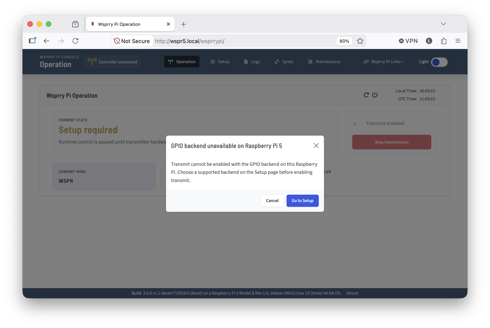
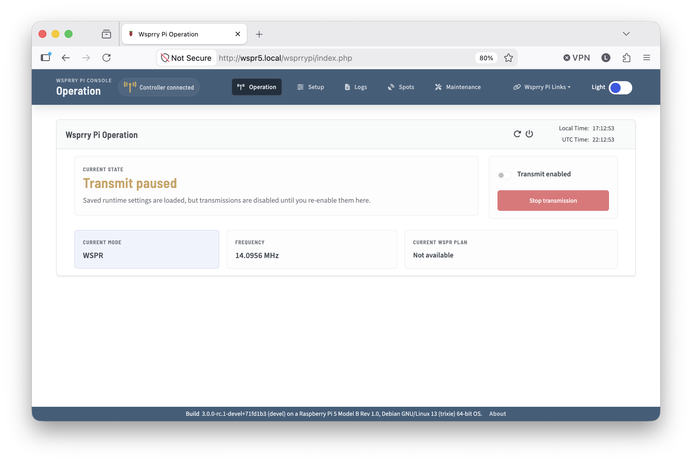
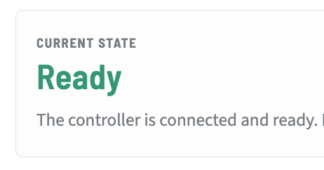
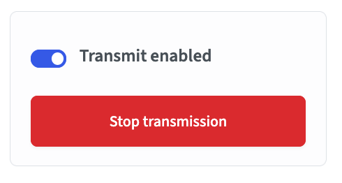

# Operations Card

The first page along the top of the Navbar is "Operations".  This page serves as the root page, and will be the most commonly monitored page during normal operations.

## Initial Operations

When you open the user interface at `http://{servername}.local`, the Apache configuration will redirect to `http://{servername}.local/wsprrypi/`.  This configuration is in place to avoid a conflict with any other websites you may have on your system.  If the installer detects another website in the root, the redirect will be disabled and you will need to append the `/wsprrypi/` manually.

If you are using a Raspberry Pi 5 or similar, you will see an indicator that the default "GPIO" transmitter is not supported.

When you select "Go to Setup" you will be directed to the `/wsprrypi/index.php?page=config&setup_tab=#transmitter-hardware-pane` tab, where the Si5351 will be automatically selected as the output path.  From here you may continue normally.

Within the Operations card are panels intended to be your quick reference nce to your current broadcast status, as well as a means to enable, disable, or stop transmissions.

- **Current State:** Gives you a color and textual representation of what the Pi is doing right now. If you are configured with valid parameters and transmissions are enabled, you will see "Ready"

    

- **Transmission Controls:** This panel contains a switch to enable to disable transmissions as well as an emergency stop.

    

  - *Transmit Enabled* switch enables or disables transmission the transmission scheduler.  When enabled, the transmitter will operate on the schedule you have configured.  If you disable it, the configuration will save immediately, however any in-progress transmissions will finish.
  - *Stop transmission* button allows you to halt an ongoing transmission immediately, and it wil disable future transmissions.  It is only enabled during a transmission.

- **Frequency:** A panel that displays the current or next frequency configured.  Keep in mind that WSPR is an upper-side band mode, so the frequency displayed will be the center frequency (where you would set your radio to transmit) and the actual frequency WSPR uses will be ~1500Hz higher.  For CW modes, this is the actual frequency of the transmission.

    

- **Current Plan** will display the current (or next if in pause mode) plan to be transmitted.  For WSPR modes, it will show the type of WSPR frame being transmitted, as well as the callsign and locator.  For CW modes it will show the message and a cursor for the character being transmitted.

    

  - *Type1Single* is a standard Type 1 WSPR frame.
  - *Type2Single* is a single Type 2 WSPR frame which sends a callsign with a prefix (`W0/`) or suffix (`/P`) as a hashed component.  The hash is not reversible.  Decoding relies on correlation over time by the receiver with previous full-message decodes from paired transmissions.
  - *Type3Single* is a single Type 3 frame which sends a reversible callsign as well as a reversible 6-character maidenhead locator.
  - *Type2Type3Paired* is a paired frame transmission mode, alternating between Type 2 (shown as F1/2) and Type 3 (shown as F2/2) messages.  This may be thought of as an automated means to assure the receiver can correlate all extended information.

  - *Next Message At* is displayed when in one of the three CW modes, and the scheduler is waiting for a transmission window.  The time is displayed in the local time.
  - *Message Progression* is displayed in CW mode during a transmission. It will show a cursor on the current character.

    
