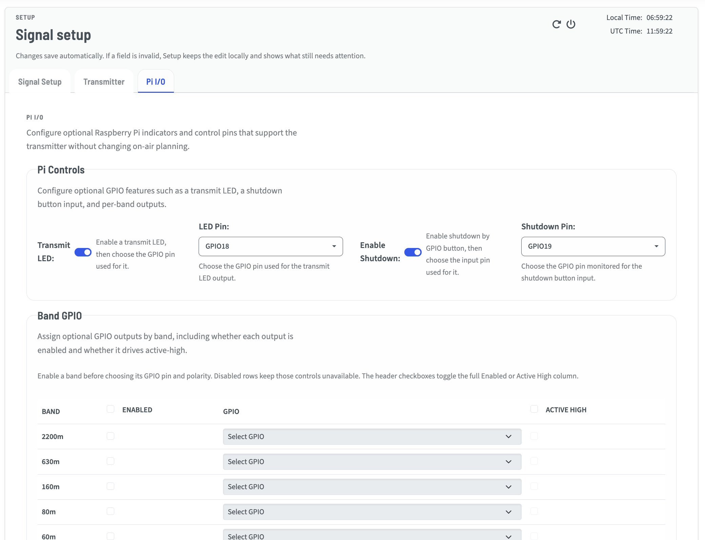
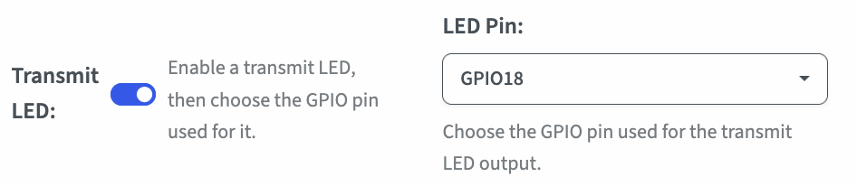
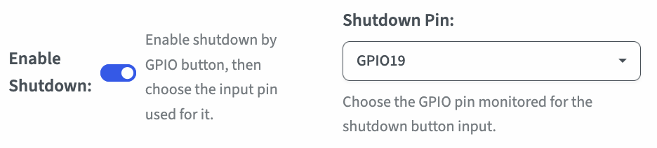
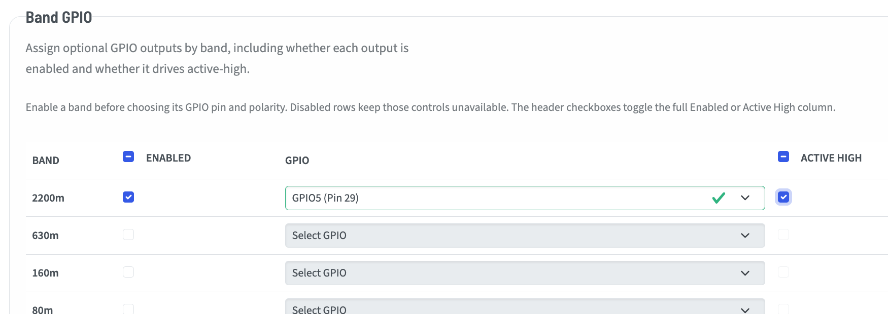

# Pi I/O Configuration Tab

The Pi I/O page contains settings for Raspberry Pi pin usage, including status indicators and hardware control lines exposed through the web interface.

## Transmit LED & LED Pin

Enabling the Transmit LED will allow you to monitor the transmission state without the Web UI.  

You may use the dropdown to configure it to a pin other than the TAPR default, which is GPIO18.

Note that this is an Active High control.  You must use and LED and a properly-sized resistor in series to ground in order for it to operate.

## Enable Shutdown & Shutdown Pin

Here you may enable a pin to be monitored for a shutdown event without requiring access to the web UI.

This is an active low input, meaning the pin is held high with an internal pull-up resistor, and when grounded (pulled low) the Wsprry Pi daemon will initiate a shutdown.

## Band GPIO

This section allows you to set pins to drive relays per band, to use a device such as the [QRP Labs Ultimate Relay-Switched LPF Kit](https://qrp-labs.com/ultimatelpf.html).

Whether you use a band selection such as `20m` in WSPR, or a specific frequency, the system will determine which band that frequency represents.  To energize a relay for that band, check the "Enabled" box for that band, select the GPIO pin you would like to use, and whether you want it to be "Active High" (checked) or "Active Low" (unchecked).

No error checking is performed intentionally.  Only pins known to be useable are included in the drop-down, but you can select the same pin for two bands.
