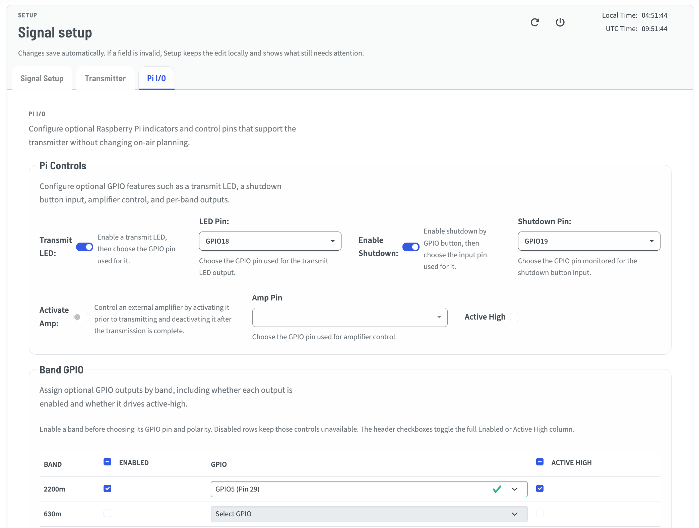
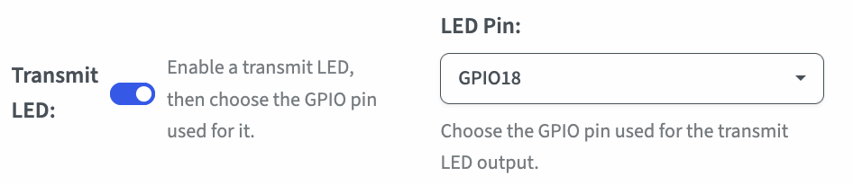
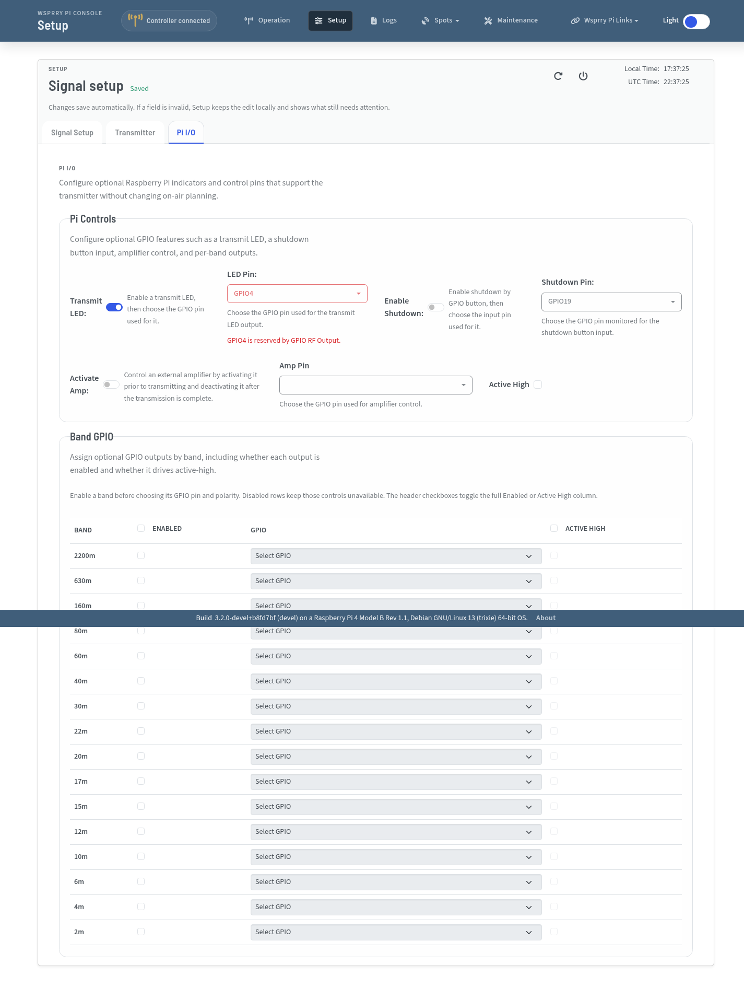
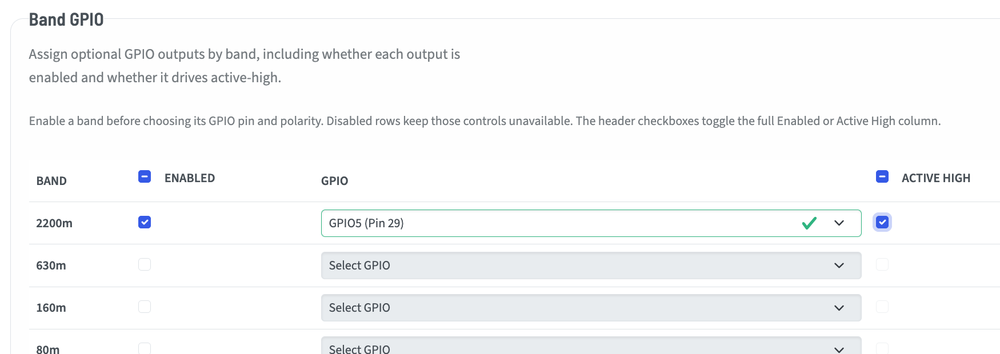

# Pi I/O Configuration Tab

The Pi I/O page contains settings for Raspberry Pi pin usage, including status indicators and hardware control lines exposed through the web interface.

## Transmit LED & LED Pin

Enabling the Transmit LED lets you monitor the transmission state without the Web UI.

You may use the dropdown to configure it to a pin other than the TAPR default, which is GPIO18.

GPIO4 and GPIO20 are available here unless the GPIO transmitter backend currently selects that same pin as its RF output. A retained conflict remains visible and blocks autosave until the LED is disabled, another LED pin is selected, the RF transmit pin is changed, or the Si5351 backend is selected.

This is an Active High control ay 3V3 intended for use with an LED and a properly sized resistor.

## Enable Shutdown & Shutdown Pin

Here you may enable a pin to be monitored for a shutdown event without requiring access to the web UI.

This is an active-low input, meaning the pin is held high with an internal pull-up resistor, and when grounded (pulled low) the Wsprry Pi daemon will initiate a shutdown.

## Activate Amp

If you use an amplifier with an activation circuit, you may dedicate a pin to activate that amp on transmission.

You may select active high or low, depending on your need.

:::{danger}
Most amplifiers allocate a pin to be grounded to its own chassis as an activation switch. Do not connect this directly to your Pi, it will overload your GPIO and may cause physical damage. A relay, SSR or MOSFET will be needed in most cases to switch the amp from the GPIO.
:::

A small PC817 Optocoupler Isolation Board, such as [this one available on Amazon](https://www.amazon.com/EC-Buying-Optocoupler-Isolation-Optoelectronic/dp/B0D3CX6NP6), may be a good ready-made solution.

## Band GPIO

This section allows you to set pins to drive relays per band, to use a device such as the [QRP Labs Ultimate Relay-Switched LPF Kit](https://qrp-labs.com/ultimatelpf.html).

Whether you use a WSPR preset such as `20m` or a specific frequency, the system
correlates the resulting frequency to one canonical band. To energize a relay
for that band, check the **Enabled** box, select the GPIO pin, and choose whether
it is **Active High** (checked) or **Active Low** (unchecked). The worldwide
correlation envelopes are broader than any one country's allocation; see
[Canonical Bands and WSPR Frequency Presets](../../../Advanced_Operations/canonical_bands.md).

The selected GPIO RF output cannot also be used by an enabled Band GPIO, Transmit LED, Shutdown Button, or Amp Control. Disabled roles may retain a pin without reserving it. The same pin can still be shared by multiple enabled bands when every assignment uses the same **Active High** setting; conflicting polarity is rejected.
