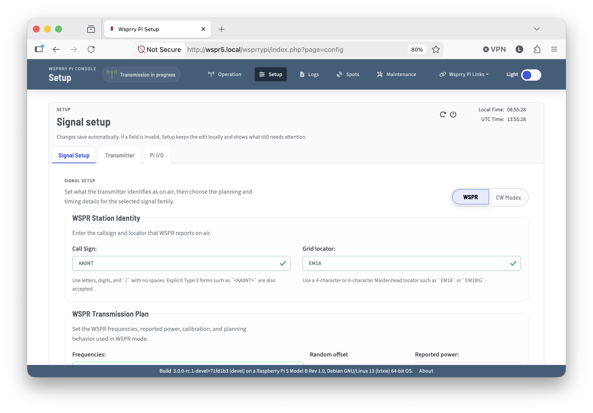
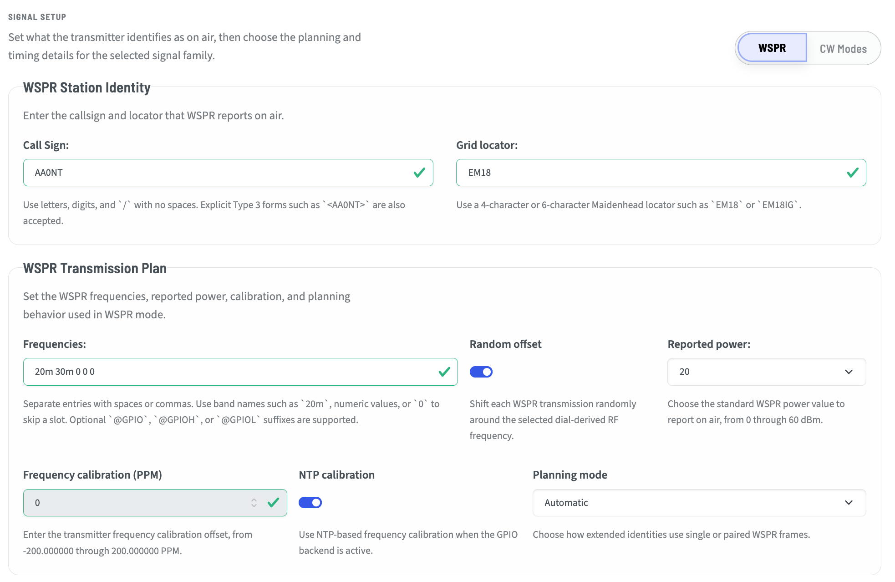
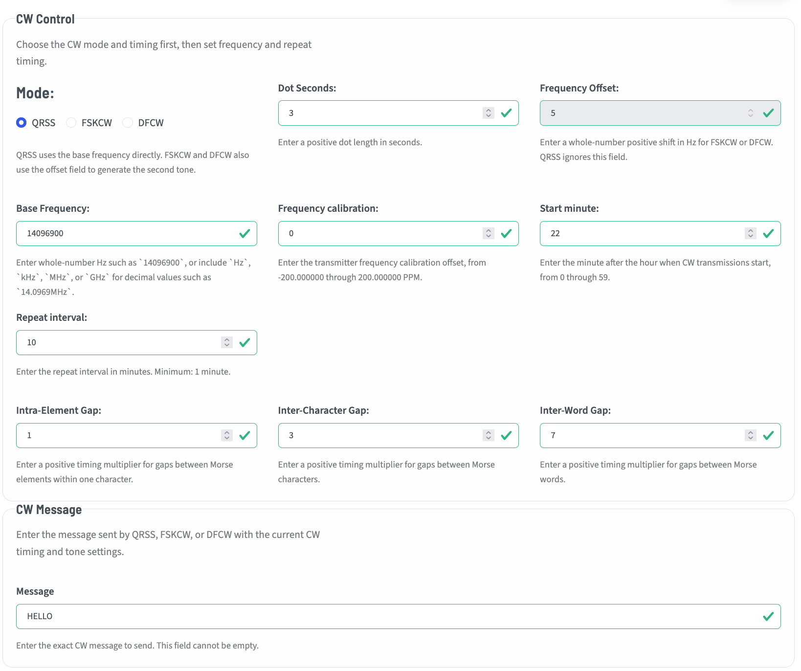

# Signal Setup Tab

The Signal Setup tab of the Signal Setup page is where configuration items related to th signal type or content are configured.

This tab has two main modes, WSPR and CW.

Set your preferred mode and the page context will change specific to that mode.

## WSPR Mode

WSPR or Weak Signal Prorogation Reporting is the original mode for Wsprry Pi.

### Station Identity

Within the Station identity section, you will set your callsign and locator.  For normal Type 1 WSPR messages, the callsign is any valid callsign of 6 characters or less.  The Grid Locator is the four character Maidenhead locator for where you are transmitting.

If you need or desire to use callsign extensions, have a callsign longer than 6 characters, or want or need to use a six-character locator, you will need to consider the use of Type 2 or 3 messages.

| Feature / Field | Type 1 | Type 2 | Type 3 |
| --- | --- | --- | --- |
| Callsign | Full callsign <=6 characters | Hashed (15-bit), not reversible | Fully encoded, may be >6 characters, reversible |
| Grid Square | 4-character Maidenhead | 4-character Maidenhead | Repurposed for callsign extension info |
| Power (dBm) | Included (0–60 dBm, quantized) | Included (0–60 dBm, quantized) | Included (0–60 dBm, quantized) |

### WSPR Transmission Plan

These settings govern the way that WSPR is transmitted or received.

#### Frequencies

The Frequencies setting is a single frequency, or a list of frequencies, separated by spaces or commas.  The frequencies may be in band format:

- 10m
- 20m
- 30m
- etc.

They may also be listed in engineering notation where these are all the same:

- 50MHz
- 0.05GHz
- 50000kHz
- 50000000Hz

Notice that there are no spaces between the number and `m` for meters, and none between the number and the engineering notation.

Finally, the frequency may be listed in pure Hz without a notation such as 21096.100.

Of note, WSPR is an Upper Side Band (USB) mode.  The frequency entered is a typical USB dial frequency.  You may note that the tones are shifted ~1,500Hz higher.

Using the bands will select the canonical WSPR frequency.

#### Random offset

Turning this switch on will acc a positive or negative random offset to the transmitted frequency.  This can be handy when there is a lot of traffic on WSPR, and allow you to find a more clear slice of the available bandwidth.

#### Reported Power

Reported power is not the same as the actual transmission power.  The transmitters settings may be attenuated by the LPF and additional gain may be added. Possible values are:

`0, 3, 7, 10, 13, 17, 20, 23, 27, 30, 33, 37, 40, 43, 47, 50, 53, 57, 60`

dBm is added to the encoder WSPR message to be a reference for the decoded message.  The operator should choose the value that is closest to their actual transmission power.

This setting hs no bearing on actual transmission power.

#### Frequency calibration (PPM) & NTP Calibration

Some operators may choose to manually calibrate their rig.  This is more important with GPIO-based transmissions where the Raspberry Pi frequencies may be impacted by power, heat, and mechanical differences.

Others may opd for the simpler and "accurate enough" NTP calibration.  This uses an internet time source to calibrate the output frequency.  For most bands, this is more than reasonable.  Some operators on higher bands such as 6m and 2m may find even a small deviation puts them out of the transmission boundaries, and may need to use a calculated PPM adjustment.

When NTP is enabled, the Frequency Calibration field is dithered.  When using the Si5351 clock module, NTP is disabled and manual calibration should be used - although the combination of a TCXO and the Si5351 is often so close, it may be ignored.

In all cases, NTP will continue to keep the Pi in sync to time messages appropriately.

#### Planning Mode

Planning mode relates to the use of Type 1, 2, and 3 messages, and the behavior when certain data elements are entered.

- **Automatic** - The planner attempts to choose the best transmission plan based on the data entered.
- **Prefer paired when available** - If the planner finds it can generate both Type 2 and 3 messages, it ill do so in alternating windows.
- **Require paired** - Requires the planner to always use a paired Type 2 and 3 message format.  For those who want the additional data to be received and understood by even the most remote stations under challenging conditions, this is likely the best choice.

## CW Mode

CW Mode, using one of QRSS, FSKCW, or DFCW, was added as of version 3 of Wsprry Pi.  It offers some new exciting methods of QRP transmissions.

CW modes are not as strictly formatted, and are **not** a beacon mode as WSPR is.  Radio beacons send continuous, automated, unattended, one-way transmissions without specific reception targets. In contrast, QRSS transmitters are only intended to be transmitting when the control operator is available to control them, and the recipients are known QRSS grabbers around the world.

### Mode

The Mode panel allows configuring most of the metadata for CW modes.

#### Mode

The actual CW mode is one of:

- **QRSS** - QRSS is extreme slow speed CW, the name is derived from the Q-code QRS (reduce your speed).  This mode, when displayed on a grabber's screen, is the most "CW-looking" of all the modes, with familiar dots and dashes.
- **FSKCW** - FSKCW means Frequency Shift Keying CW.  Instead of activate/deactivate the carrier, the carrier is always activated as long as the transmission lasts. During pauses between dots, dashes or characters the frequency is shifted downwards.  The upper trace shown on the screen contains the morse information, the lower trace is drawn during signal pauses.
- **DFCW** - DFCW means Dual Frequency CW.  DFCW mode was developed that enhances the average speed in LF transmissions (more impacted by QRN) by a factor of 2.5 to 3. In DFCW the element *duration* is replaced by the element *frequency*. Dots and dashes do not have a different length but they are transmitted on a different frequency. Due to this frequency shift there is no space needed between the dots/dashes and the character space can be reduced to the same dot length. A short space (typically 1/3 of a dot length) is added between the dots and dashes for ease of copy.

#### Dot seconds

Dot seconds are the basis for timing the character elements.  If a dot is 3 seconds, a dash is 3*dot or 9 seconds.

#### Frequency offset

This is the positive offset from the base that FSKCW or DFCW will shift to transmit characters.  This is in Hz and should be entered without any engineering notation.  This field is dithered and unavailable in QRSS mode.

#### Base frequency

This is the base frequency for transmissions.  For QRSS it is the exact frequency of the characters.  For FSKCW or DFCW it is the base from which the shift is made to transmit.  This is entered as a whole-number in Hz such as `14096900`, or include `Hz`, `kHz`, `MHz`, or `GHz` for decimal values such as `14.0969MHz`.

#### Frequency calibration

This is the CW form of the PPM/NTP settings in WSPR.  Here you may calibrate your frequency (the actual tone frequency, as opposed to the SSB offset for WSPR) in PPM.  Your available range is +-200PPM.

#### Start minute / Repeat interval

QRSS operators generally start ad the 0 minute, and every 10 minutes thereafter.  Start at 0 and Repeat at 10 will enable this cadence.

#### Intra-Element Gap

This adds a small gap in between elements of a character.  In other words, an "S" without gaps may be indistinguishable from a "T".  This is a positive multiplier applied to the dot seconds.

#### Inter-Character Gap

This adds gaps between characters, as a multiplier applied to the dot timing.  Typically this is 3*dot length.

#### Inter-Word Gap

This adds gaps between words, as a multiplier applied to the dot timing.  Typically this is 7*dot length.

### CW Message

Any message may be entered in this box that can me represented by the 26 letters and 10 numerals.  The length of the message is factored against the dot seconds and other derived timings, and the interface will throw an error if the message would be 15 minutes and the "repeat every" is set for 10 minutes.
