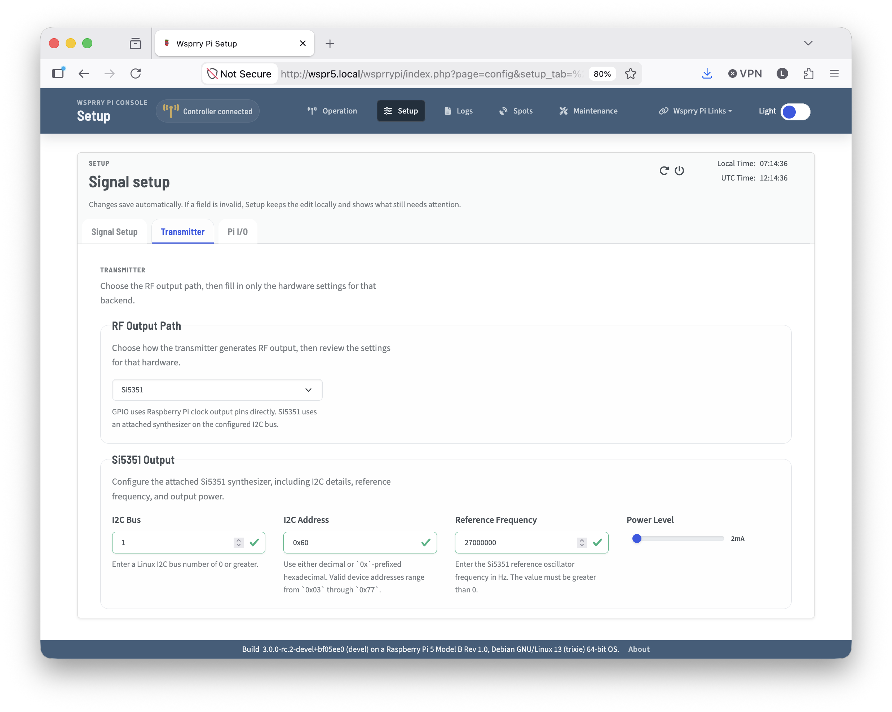
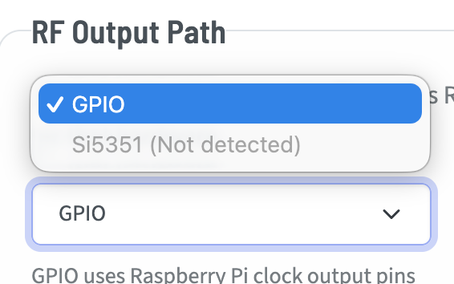
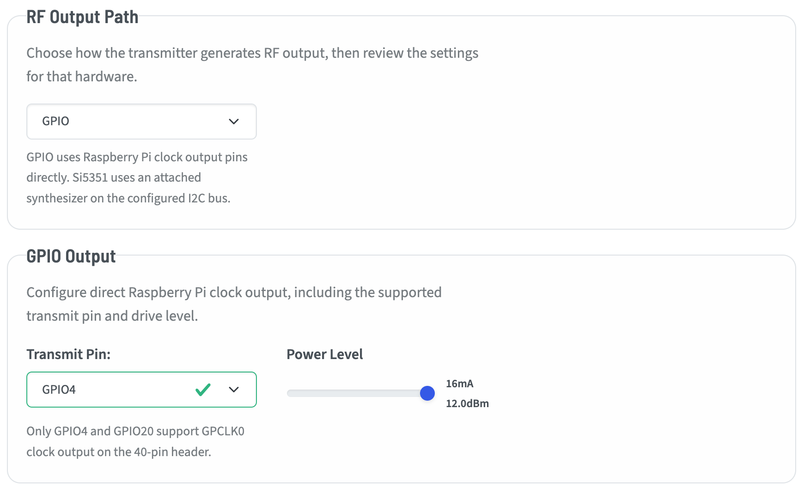
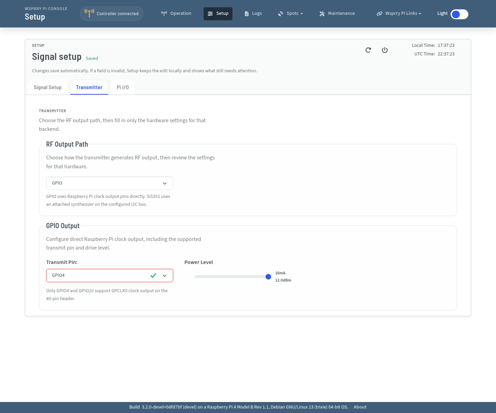

# Transmitter Configuration Tab

The Transmitter tab on the Signal Setup page contains settings related to the active output hardware path and transmission behavior.

Use this page to choose the transmitter backend and review the hardware-specific configuration required for your station.  Either the GPIO or Si5351 is chosen to display contextual setup fields.

- **GPIO** - Available on the Raspberry Pi models before the Pi 5.
- **Si5351** - If detected, the Si5351 may be used on any supported Raspberry Pi.

## GPIO

GPIO-based transmissions are the typical method most people think of when they think of Wsprry Pi.  It uses a GPIO Pin attached to a clock generator on the Pi to transmit WSPR tones.

It is available to select on all Pi versions before the Pi 5.

Conducted testing qualifies this backend on 80 m, 20 m, 15 m, and 10 m with
the production pacing value. WsprryPi rejects GPIO requests in the 12 m, 6 m,
and 2 m band ranges before transmitter activation. The restriction applies to
scheduled operation and Test Tone and does not limit the Si5351 backend. See
[GPIO Band Capabilities and Signal Quality](../../../FAQ/why_12m_looks_noisy.md).

There are only two choices when setting up the GPIO-based transmitter:

### Transmit Pin

GPIO4 and GPIO20 are the supported direct RF output choices. The selected pin is reserved by the GPIO backend even when transmission is disabled, because Wsprry Pi must retain ownership of the configured RF path for startup and safe-state handling.

The other pin remains available on the **Pi I/O** tab. Selecting the Si5351 backend releases both GPIO4 and GPIO20 for ordinary GPIO roles; the retained GPIO transmit-pin value is ignored while Si5351 is selected.

If an existing configuration assigns the selected RF pin to an enabled ordinary GPIO role, both controls remain visible and are marked invalid until one assignment is changed or disabled. Invalid edits are not saved.

### GPIO Power Level

These are output driver strength levels mapped within the Pi's GPIO registers.  You may adjust the output from 0-7 with the slider.  The values roughly align to power levels at the pin before any amplification or filtering:

1. 2 mA: ~-7.0 dBm
2. 4 mA - ~-1.0 dBm
3. 6 mA - ~2.6 dBm
4. 8 mA - ~5.1 dBm
5. 10 mA - ~7.0 dBm
6. 12 mA - ~8.6 dBm
7. 14 mA - ~9.9 dBm
8. 16 mA - ~11.1 dBm

Actual output should be measured with the entire circuit and antenna.

## Si5351

The Si5351 is selectable as an output device on all supported Pi versions.  If the application cannot validate communication with the Si5351, it will show that it is not detected when viewed in the dropdown.

### I2C Bus

While the Raspberry Pi has two GPIO bus (0 and 1), at the time of this writing only Bus 1 should be used.

### I2C Address

The default I2C bus address for the Si5351 is 0x60.  It may be configured to 0x61 by pulling the A0 pin high.  Other models and clones may have different addresses.

### Reference Frequency

You must have a reference frequency to govern the clock generator.  QRP Labs breakout boards use a 27MHz TCXO, where the Adafruit breakouts I have seen use 25MHz.  Either will work fine for most frequencies.  QRP Labs has shared in some notes that 25MHz fails to divide to frequencies that can cleanly support 2M transmissions, so they have standardized on 27MHz.

Enter the frequency that corresponds to the installed reference hardware.

### Reference Source

Choose **External clock / TCXO** for a module driven by an active reference. This is the default and preserves existing behavior. Choose **Passive crystal** only when a crystal is connected across the Si5351 XA/XB pins.

When **Passive crystal** is selected, the **Crystal Load Capacitance** menu appears with 6, 8, and 10 pF choices. Select the value specified for the installed crystal; 10 pF is the default. The menu is hidden and its value is not programmed when **External clock / TCXO** is selected.

### Si 5351 Power Level

The Si5351 has four configurable power levels:

1. 2mA - ~0 to +3 dBm
2. 4mA - ~+3 to +6 dBm
3. 6mA - ~+6 to +8 dBm
4. 8mA - ~+8 to +10 dBm

While these are technically feasible levels, the device is not intended to drive a load.  It should be followed by an amplifier of some sort.
