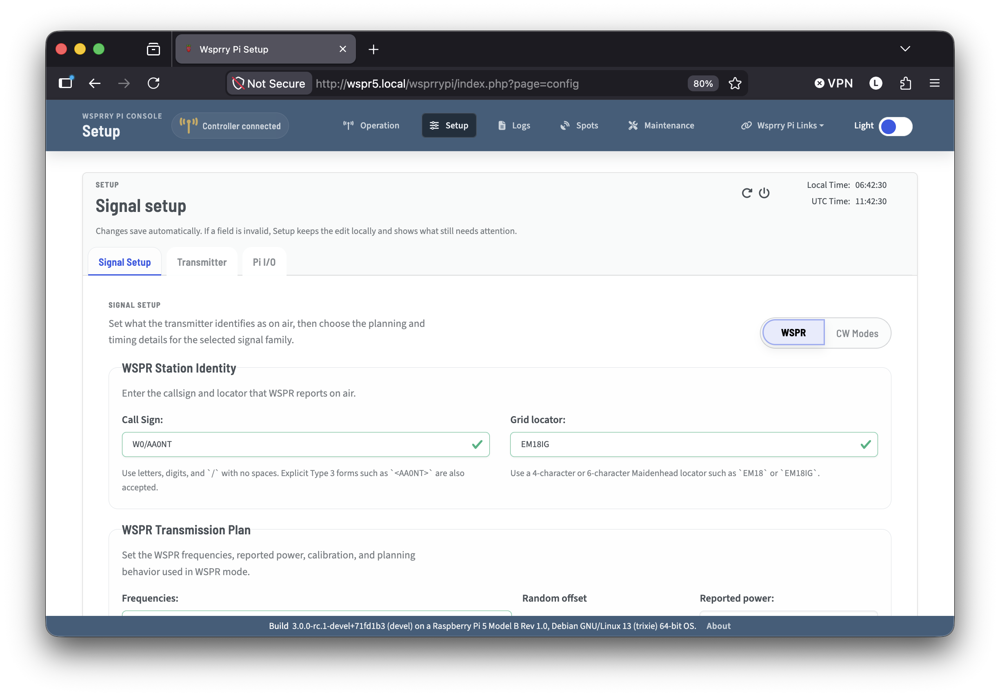
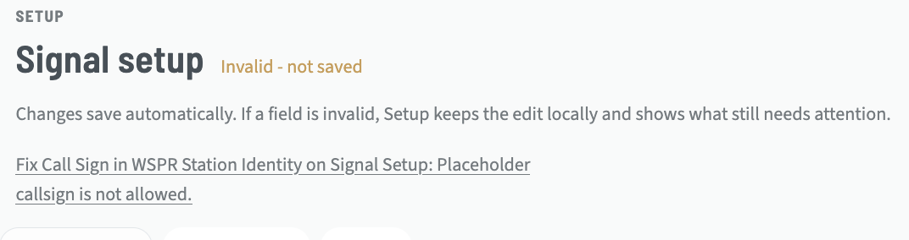
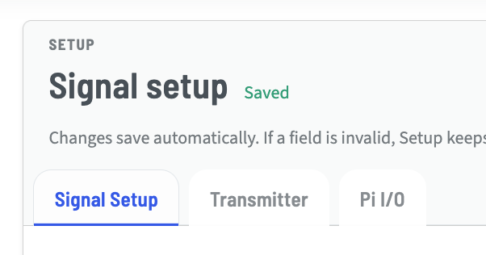

# Setup Card

This card is where your normal day-to-day configuration changes happen. Several settings are intentionally not exposed in the web UI because they are reserved for development and experimental use.

Settings will save, or throw an error in the indicator at the top of the pace.  No special "Save" button is required or provided.

```{toctree}
:maxdepth: 1
:hidden:

Signal_Setup/index
Transmitter/index
Pi_IO/index
```



The card title section contains contextual information, such as an indicator that the settings were unable to be saved with a hint for where to look:



Or, it will indicate that the settings have been successfully saved:



This contextual information is included on all sub-tabs and views within the Setup card.

The Setup card is divided into three sub-pages:

- Signal Setup for callsign, mode, and message-related settings.
- Transmitter for hardware output-path selection and related transmission settings.
- Pi I/O for Raspberry Pi pin assignments and indicator behavior.
