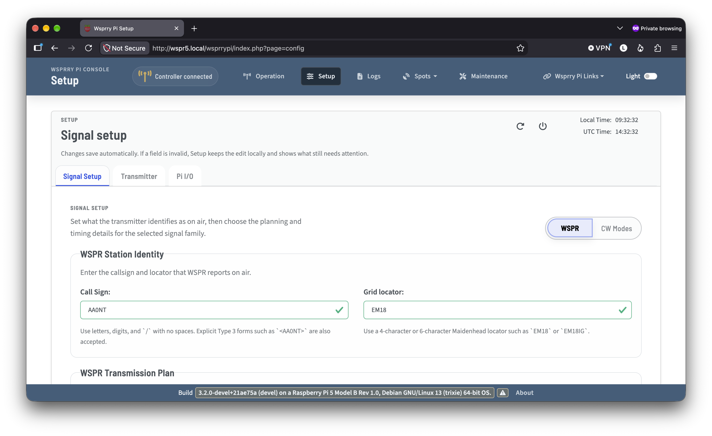
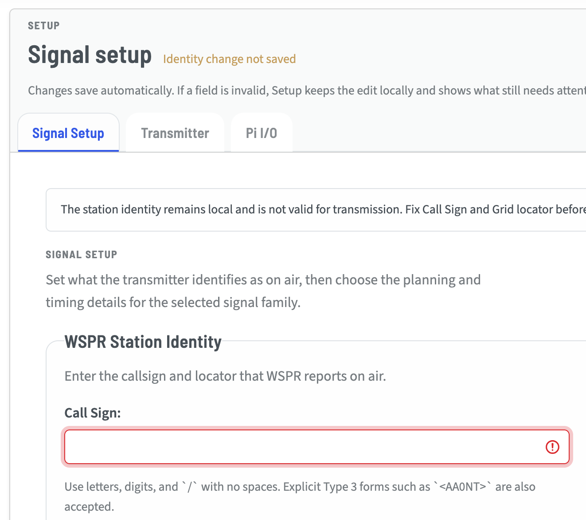
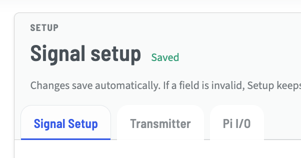

# Setup Card

This card is where your normal day-to-day configuration changes happen. Several settings are intentionally not exposed in the web UI because they are reserved for development and experimental use.

Settings will save, or throw an error in the indicator at the top of the page.  No special "Save" button is required or provided.

If a change cannot be saved, a brief status appears beside the Setup title. Details about what needs attention appear below the tabs:

Or, it will indicate that the settings have been successfully saved:

This contextual information is included on all sub-tabs and views within the Setup card.

The Setup card is divided into three sub-pages:

- [Configure WSPR and CW](Signal_Setup/index.md) for callsign, mode, and message-related settings.
- [Configure Transmitter](Transmitter/index.md) for hardware output-path selection and related transmission settings.
- [Configure Raspberry Pi I/O](Pi_IO/index.md) for Raspberry Pi pin assignments and indicator behavior.

<!-- if-wsprrypico -->
## Pi and Pico Fleet setup

The development **Fleet** tab is hidden and disabled on each page load until
explicitly enabled for that browser session. Showing the tab does not start
transmission. The [device catalog workflow](Transmitter/index.md#pico-development-controls)
explains how to identify and save a profile. Pi servers use **Plain LAN**;
this implementation does not provide inbound TLS on the Pi.

### Assign an output schedule

Fleet assignments and listener settings use explicit save buttons, unlike
ordinary Setup autosave. Review the feedback beside the action before leaving.

1. Save and verify a profile for each target Pi or Pico. For a Pi, use its
   WTP port (default `31417`) and status HTTP port (default `31415`).
2. In **Output schedules**, choose **Assign a schedule**, select a **Saved
   output**, and enter its mode, RF base frequency in Hz, job parameters, repeat
   period, and UTC phase. For a Pi, confirm **Use Plain LAN for this assignment**.
3. Choose **Save assignment**. It starts paused unless **Start this output's schedule
   after saving** is selected. Use **Resume** when ready to run it.

A central Pi supports zero through eight remote output schedules alongside its
own local schedule. **Use this device** selects the separate single-endpoint
`[WTP]` backend; it does not create an independent output assignment. Saving or
removing a catalog profile also does not create or remove an assignment.

Each target must advertise support for the assigned job. The Pi Si5351 server
reports its existing WSPR, TONE, QRSS, FSKCW and DFCW capabilities. Its qualified
amateur bands from 2200m through 2m retain their existing frequency policy.
Pi and Pico jobs are checked against the selected target's reported capabilities. For a Pi profile, set the start-uncertainty limit
to accommodate the reported clock uncertainty, no higher than `500000000` ns
(500 ms); the existing 1 ms default can reject ordinary NTP timing. Values are
never silently increased.

Remote scheduling requires the controller's explicit
[unqualified-frequency permission](../../Command_Line_Operations/transmitter_backends.md#experimental-frequency-policy).
A saved profile or discovered device does not grant that permission.

**Pause and stop**, **Edit schedule**, **Reconcile**, and **Remove assignment**
affect only the selected output. Editing requires a paused, reconciled output.
Failed or uncertain work pauses that assignment; after an interrupted job,
use **Reconcile**, inspect the result, then **Resume**. A consumed schedule slot
is not automatically retried. Other remote outputs and the local schedule
remain independent. A disconnected target has unknown output state; loss of
contact does not prove it stopped.

### Configure the target Pi

Expand **This Pi's WTP listener** to configure inbound admission, port, and
interface, then choose **Save listener settings**. The listener defaults to enabled on port `31417`. With local Enable
off, it accepts ownership claims after startup confirms safe, idle output.
Local Enable on reserves the output, including gaps between local jobs;
inspection remains available but new claims are refused. Outbound Fleet
schedules do not change either setting.

`auto` selects a single eligible physical LAN IPv4 interface. If several are
eligible, select one explicitly, such as `eth0` or `wlan0`. Avahi advertises the
listener through DNS-SD. If discovery is unavailable, a manual Plain LAN profile
can still use the configured address and port. A discovery entry is only a
connection hint; identify the device before saving it. Plain LAN is unencrypted
and its observed device ID is not cryptographic authentication.

See [local takeover](../index.md#local-control-and-remote-ownership) before
reclaiming an output from a remote controller, and the
[listener INI reference](../../Advanced_Operations/ini_configuration/runtime.md#wtp-server)
for interface and recovery details.
<!-- endif-wsprrypico -->
