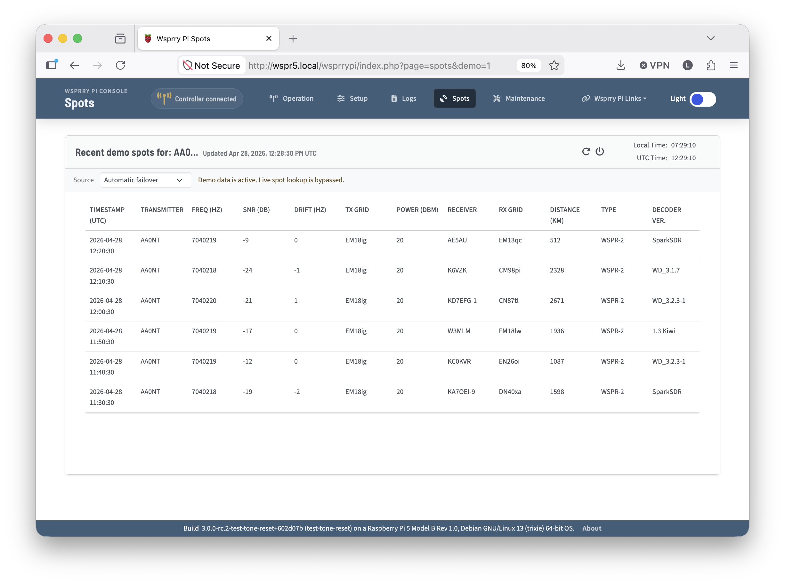
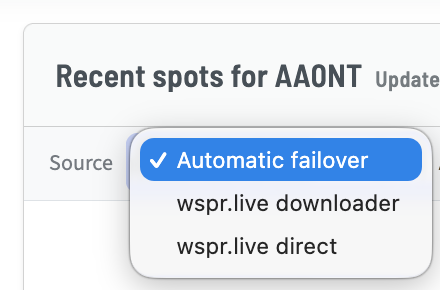

# Spots Card

The Spots card will perform a query against WSPRNet.  The spots page will auto-refresh the previous 60 minutes of spots from your callsign every five minutes.

It defaults to the [downloader API](https://wspr.live/wspr_downloader.php), but if configured or if the initial pull fails, it will fall back to the [ClickHouse URL](https://db1.wspr.live/).  This functionality was added during a recent website issue where the dlownloader URL was not available.

