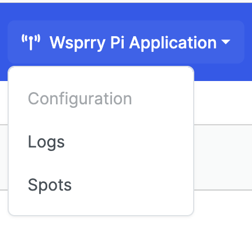

<!-- Grammar and spelling checked -->
# Web UI Operations

The web interface is the primary day-to-day control surface for Wsprry Pi. It provides configuration, status, logs, and recent spots in one responsive layout.

```{toctree}
:maxdepth: 1
:hidden:

Configuration/index
Logs/index
Spots/index
```


Use the web UI in this order:

- Confirm the application is connected and healthy from the header.
- Review or change configuration on the Configuration page.
- Check Logs if the daemon does not behave as expected.
- Review recent reception reports on the Spots page.

## Navbar

The navbar is the blue bar pinned to the top of the page.

### Transmission Indicator


The antenna icon turns color depending on the status of the application:

- **Red:** Indicates the web page is disconnected from the application. The page has just opened and the Web Socket connection has not yet been negotiated. If it remains red, the daemon may not be running.
- **Orange:** Indicates the web page is negotiating the connection to the application.
- **Yellow/Gold:** Indicates the web page is connected to the application, but no transmission is in progress.
- **Green:** Indicates a transmission is in progress.

If color alone is not a reliable indicator, hover over the icon to see the text status.

### WSPR Links


- **Wsprry Pi Application:** A drop-down is available on each page with links to the Wsprry Pi pages.
- **Documentation:** Opens the online documentation in a new tab.
- **GitHub:** Opens the source repository, issue tracker, and development history.
- **TAPR:** Opens the TAPR site in a new tab.
- **WSPRNet Spots:** Opens the WSPRNet database and, if your call sign is configured, goes directly to your most recent spots.

#### Wsprry Pi Application



Three pages are available here:

- **Configuration:** The main Wsprry Pi page where you configure and control the station.
- **Logs:** Shows the 500 most recent daemon log entries. Full command-line logs are still available when you need more detail.
- **Spots:** Courtesy of [WSPR Live](https://wspr.live/wspr_downloader.php?), shows the last 60 minutes of spots and refreshes every five minutes.

### Web Page Mode


Wsprry Pi supports a light and dark presentation mode in the web interface.


## Card Header

Each page contains a card with a shared header area. The header is the shaded region at the top of the main content card.

### Card Info

Contextual information about the current page appears on the left side of the card header.

#### Server Control

On the top right side before the clock are server control icons:


The icon on the left reboots the Raspberry Pi. When selected, the transmission LED, if configured, flashes twice and the system reboots.

The icon on the right powers off the Raspberry Pi. When selected, the transmission LED, if configured, flashes three times and the system shuts down immediately. In many setups you will need to remove and reapply power before the Pi can start again.

#### Clock

On the far right side of the card header is a clock displaying both local and UTC time:


## Application Pages / Card Bodies

The card body contains the page-specific controls and data. You may need to scroll to see all options. The layout is responsive and is intended to remain usable on both phones and desktop browsers.

Changes are not applied until you save them.
