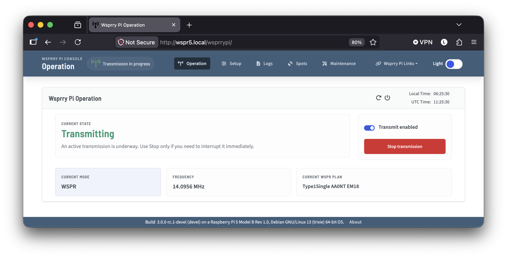
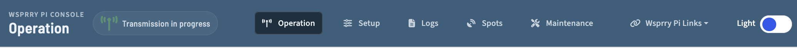
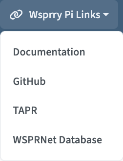
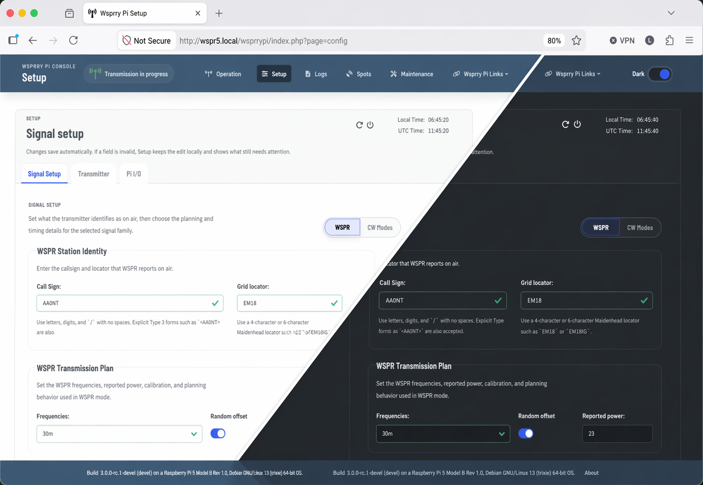
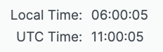
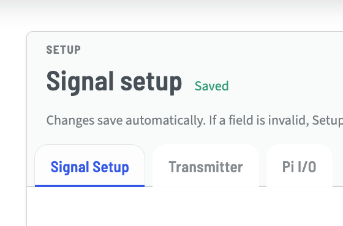
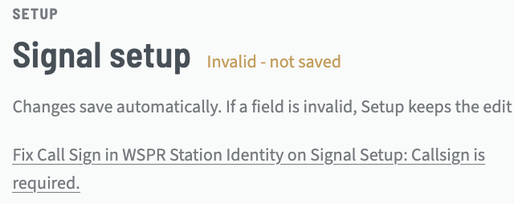

# Web UI Operations

The web interface is the primary day-to-day control surface for Wsprry Pi. It provides configuration, status, logs, and recent spots in one responsive layout.

```{toctree}
:maxdepth: 1
:hidden:

Operations/index
Setup/index
Logs/index
Spots/index
Maintenance/index
```



Use the web UI in this order:

- Confirm the application is connected to the backend via the header indicators.
- Review or change configuration on the Setup page.
- Check Logs if the daemon does not behave as expected.
- Review recent reception reports on the Spots page.
- Monitor typical operations from the Operation page.

## Navbar

The navbar is the blue bar pinned to the top of the page.

### Transmission Indicator


The antenna icon turns color depending on the status of the application:

- **Red:** Indicates the web page is disconnected from the application. The page has just opened and the Web Socket connection has not yet been negotiated. If it remains red, the daemon may not be running.
- **Orange:** Indicates the web page is negotiating the connection to the application.
- **Yellow/Gold:** Indicates the web page is connected to the application, but no transmission is in progress.
- **Green:** Indicates a transmission is in progress.

### Main Application Links



- **Operation:** The landing page and main view for active operations.
- **Setup:** Configure the transmission parameters and hardware interface.
- **Logs:** View the WsprryPi logs via a live interface to the Pi's `journald` daemon.
- **Spots:** A view of the most recent spots of your callsign from the WSPRnet database.
- **Maintenance:** Recovery operations to fix configuration errors, as well as a test tone generator.

#### Wsprry Pi Links Dropdown



Three pages are available here:

- **Documentation:** This documentation, hosted at Read The Docs.
- **GitHub:** The main GitHub organization, containing all of the repositories supporting this project.
- **TAPR:** TAPR is a non-profit 501(c)(3) organization of amateur radio (“ham”) operators who are interested in advancing the state of the radio art.  TAPR offers pre-built Pi HATs for Wsprry Pi in their store, among other items.
- **WSPRNet Database:** The WSPRNet.or's database interface, where you may perform lookups on WSPR reports.

### Web Page Mode


Wsprry Pi supports a light and dark presentation mode in the web interface.



## Card Header

Each page contains a card with a shared header area. The header is the shaded region at the top of the main content card.

### Card Info

Contextual information about the current page appears on the left side of the card header.

#### Server Control

On the top right side before the clock are server control icons:


The icon on the left reboots the Raspberry Pi. When selected, the transmission LED, if configured, flashes twice and the system reboots.

The icon on the right powers off the Raspberry Pi. When selected, the transmission LED, if configured, flashes three times and the system shuts down immediately. In many setups you will need to remove and reapply power before the Pi can start again.

#### Clock

On the far right side of the card header is a clock displaying both local and UTC time:



## Application Pages / Card Bodies

The card body contains the page-specific controls and data. You may need to scroll to see all options. The layout is responsive and is intended to remain usable on both phones and desktop browsers.

Changes are saved as you make them.  The status of the save is shown in the card header.



Any errors will be indicated there, with text directing you to the issue.


